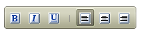

# Two State Buttons

## 

**RadToolBarButton** supports use as a two-state button, where the button can be "on" (checked) or "off" (unchecked). The checked state has an appearance distinct from other buttons in the toolbar to reflect its state.

To enable a button as a two-state button, set its **CheckOnClick** property to **True**. When a button has **CheckOnClick** set to **True**, its **Checked** property specifies whether it is "On" or "Off".

There are two models for the way two-state buttons can work:

* The user clicks the button to turn it "on". It remains in that state until the user clicks it again to turn it "off". To enable this model, set the **AllowSelfUnCheck** property to **True**.

* The button acts like a radio button in a group of buttons, where one of the buttons in the group is checked at all times. When the user clicks on another button in the group, the first button becomes unchecked.To enable this model, set the **Group** property for every button in the group to a string that identifies the group of buttons.

The following example illustrates how to create both types of two-state buttons:



````ASPNET
<telerik:RadToolBar RenderMode="Lightweight" ID="RadToolBar1" runat="server" Skin="Hay">
    <Items>
        <telerik:RadToolBarButton runat="server" ImageUrl="~/Images/bold.gif" AllowSelfUnCheck="True"
            CheckOnClick="True" />
        <telerik:RadToolBarButton runat="server" ImageUrl="~/Images/Italic.gif" AllowSelfUnCheck="True"
            CheckOnClick="True" />
        <telerik:RadToolBarButton runat="server" ImageUrl="~/Images/underline.gif" AllowSelfUnCheck="True"
            CheckOnClick="True" />
        <telerik:RadToolBarButton runat="server" Enabled="False" Text="|" />
        <telerik:RadToolBarButton runat="server" Checked="True" CheckOnClick="True" Group="Justify"
            ImageUrl="~/Images/LJ.gif" />
        <telerik:RadToolBarButton runat="server" CheckOnClick="True" Group="Justify" ImageUrl="~/Images/J.gif" />
        <telerik:RadToolBarButton runat="server" CheckOnClick="True" ImageUrl="~/Images/RJ.gif" />
    </Items>
</telerik:RadToolBar>
````


