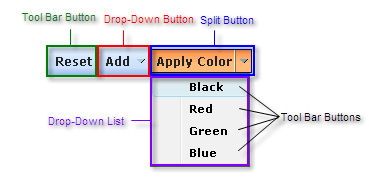

# Structure


## 

The structure of the __RadToolBar__control is as follows:


>caption 



The toolbar is a container that holds different types of buttons. There are three types of buttons that can appear in the toolbar. Each button type is a descendant of __RadToolBarItem__:

* __Tool Bar Buttons__: Tool bar buttons (__RadToolBarButton__) are buttons that the user can click to perform some task.

* __Drop-Down Buttons__: Drop-down buttons (__RadToolBarDropDown__) do not perform a task. Instead, when the user clicks a drop-down button, it displays its __drop-down list__. The drop-down list contains one or more toolbar buttons that the user can click to perform some task.

* __Split Buttons__: Split buttons (__RadToolBarSplitButton__) combine the features of toolbar buttons and drop-down buttons. When the user clicks on a split button, it performs a task like a toolbar button. When the user clicks on the drop-down arrow, it opens a __drop-down list__, where the user can click on a toolbar button.

The buttons in the toolbar are contained in the __Items__ collection of the __RadToolBar__ object. The buttons in the drop-down list of a __RadToolBarDropDown__ or __RadToolBarSplitButton__ are contained in the __Buttons__ collection of the drop-down button or split button:

````ASPNET
	    <telerik:RadToolBar ID="RadToolBar1" runat="server" Skin="Outlook">
	        <Items>
	            <telerik:RadToolBarButton runat="server" Text="Reset" />
	            <telerik:RadToolBarDropDown runat="server" Text="Add">
	                <Buttons>
	                    <telerik:RadToolBarButton runat="server" Text="Row Above" />
	                    <telerik:RadToolBarButton runat="server" Text="Row Below" />
	                    <telerik:RadToolBarButton runat="server" IsSeparator="True" />
	                    <telerik:RadToolBarButton runat="server" Text="Column Left" />
	                    <telerik:RadToolBarButton runat="server" Text="Column Right" />
	                </Buttons>
	            </telerik:RadToolBarDropDown>
	            <telerik:RadToolBarSplitButton runat="server" Text="Apply Color" EnableDefaultButton="False">
	                <Buttons>
	                    <telerik:RadToolBarButton runat="server" Text="Black" />
	                    <telerik:RadToolBarButton runat="server" Text="Red" />
	                    <telerik:RadToolBarButton runat="server" Text="Green" />
	                    <telerik:RadToolBarButton runat="server" Text="Blue" />
	                </Buttons>
	            </telerik:RadToolBarSplitButton>
	        </Items>
	    </telerik:RadToolBar>
````


# See Also

 * [Overview]()

 * [Declaring Items Statically at Design Time]()
