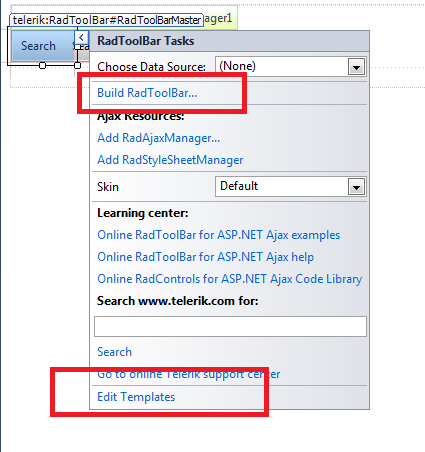
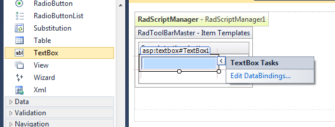
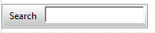

# Adding and Editing Templates at Design Time

## 

With RadToolBar it is really easy to add and edit templates at design time. The steps below describe how to add a textbox to a toolbar button and how to set its Tooltip property.

1. Click on RadToolBar's __smart tag__ and choose __Edit Templates__.

2. Click on the buttons' dropdown and choose the button for which you will add a template control.

3. Drag a control to the template surface and right-click on it to show its properties dialog. In this case, we add a textbox control and set its ToolTip property.

4. Finally, click again on RadToolbar's smart tag and choose __End Template Editing__.

Now the toolbar will look like this

# See Also

 * [Template Design Surface]()
