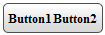

# Adding and Editing Templates at Runtime


## 

You can also add templates to __RadToolBar__ at runtime, using the __ItemTemplate__ property of the RadToolBarButtons and RadToolBarSplitButtons. This property is of type __ITemplate__, so you must assign an object that implements that interface as a value:

>note Only __RadToolBarButton__ and __RadToolBarSplitButton__ support templates. If you set a template to a RaToolBarSplitButton, this template will not be inherited by the child buttons of the split button. If you want to define templates for the child buttons, you should define an ItemTemplate for each child button.
>


>note The buttons (split buttons) should be dynamically added so that templates can be defined at run time.
>Also, the buttons (split buttons) should be bound to be able to eval __DataBinder__ expressions. In other words, you should call the __DataBind__ method of the RadToolBar object or bind the buttons (split buttons) that are about to use __DataBinder.Eval__ . You can bind a specific button (split button) by calling the __DataBind__ method of this specific button (split button).
>


|  | The template has to be instantiated for each button (split button) upon a postback. Since the TextBoxTemplate class initializes the label on InstantiateIn we called the InstantiateIn method of the TextBoxTemplate object for each button (split button). |
| ------ | ------ |

## 

>tabbedCode

````C#
	     
		protected void Page_Load(object sender, EventArgs e){ 
	        if (!Page.IsPostBack) 
	        {
	            RadToolBar1.Items.Add(new RadToolBarButton("Button1"));
	            RadToolBar1.Items.Add(new RadToolBarButton("Button2"));
	        } 
	        TextBoxTemplate template = new TextBoxTemplate(); 
	        foreach (RadToolBarItem item in RadToolBar1.Items) 
	        {  
	            if(item is RadToolBarButton)      
	                template.InstantiateIn(item); 
	        } 
	        RadToolBar1.DataBind();
	    }
	
	    class TextBoxTemplate : ITemplate
	    {
	        public void InstantiateIn(Control container) 
	        {     
	            Label label1 = new Label();   
	            label1.ID = "ItemLabel";
	            label1.Text = "Text";  
	            label1.Font.Size = 10;   
	            label1.Font.Bold = true;  
	            label1.DataBinding += new EventHandler(label1_DataBinding);  
	            container.Controls.Add(label1);
	        }
	
	        private void label1_DataBinding(object sender, EventArgs e) 
	        {  
	            Label target = (Label)sender;  
	            RadToolBarButton button = (RadToolBarButton)target.BindingContainer; 
	            string buttonText = (string)DataBinder.Eval(button, "Text"); 
	            target.Text = buttonText; 
	        }
	    }
				
````


````VB.NET
	    
	    Protected Sub Page_Load(ByVal sender As Object, ByVal e As EventArgs)
	        If Not Page.IsPostBack Then
	            RadToolBar1.Items.Add(New RadToolBarButton("Button1"))
	            RadToolBar1.Items.Add(New RadToolBarButton("Button2"))
	        End If
	        Dim template As New TextBoxTemplate()
	        For Each item As RadToolBarItem In RadToolBar1.Items
	            If TypeOf item Is RadToolBarButton Then
	                template.InstantiateIn(item)
	            End If
	        Next
	        RadToolBar1.DataBind()
	    End Sub
	
	    Class TextBoxTemplate
	        Implements ITemplate
	
	        Public Sub InstantiateIn(ByVal container As Control) Implements ITemplate.InstantiateIn
	            Dim label1 As New Label()
	            label1.ID = "ItemLabel"
	            label1.Text = "Text"
	            label1.Font.Size = 10
	            label1.Font.Bold = True
	            AddHandler label1.DataBinding, AddressOf label1_DataBinding
	            container.Controls.Add(label1)
	        End Sub
	
	        Private Sub label1_DataBinding(ByVal sender As Object, ByVal e As EventArgs)
	            Dim target As Label = DirectCast(sender, Label)
	            Dim button As RadToolBarButton = DirectCast(target.BindingContainer, RadToolBarButton)
	            Dim buttonText As String = DirectCast(DataBinder.Eval(button, "Text"), String)
	            target.Text = buttonText
	        End Sub
	    End Class
	
````


>end

The end result of this code looks like the following:


