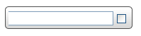
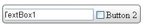

# Data Binding Expressions


## 

Often, when you use item templates, you want the controls in the template to display information associated with the tool button properties. For example, consider a simple toolbar with a text box in one item template and a check box in another:

````ASPNET
	    <telerik:RadToolBar ID="RadToolBar1" runat="server">
	        <Items>
	            <telerik:RadToolBarButton runat="server" Text="Button 1" Value="TextBox1">
	                <ItemTemplate>
	                    <asp:TextBox ID="TextBox1" runat="server" />
	                </ItemTemplate>
	            </telerik:RadToolBarButton>
	            <telerik:RadToolBarButton runat="server" Text="Button 2">
	                <ItemTemplate>
	                    <asp:CheckBox ID="CheckBox1" runat="server" />
	                </ItemTemplate>
	            </telerik:RadToolBarButton>
	        </Items>
	    </telerik:RadToolBar>
````


When you run the application, the button templates display as an empty text box and an unlabelled check box:



````ASPNET
	<telerik:RadToolBar ID="RadToolBar1" runat="server">
	    <Items>
	        <telerik:RadToolBarButton runat="server" Text="Button 1" Value="TextBox1">
	            <ItemTemplate>
	                <asp:TextBox ID="TextBox1" Text='<%# DataBinder.Eval(Container, "Value") %>' runat="server" />
	            </ItemTemplate>
	        </telerik:RadToolBarButton>
	        <telerik:RadToolBarButton runat="server" Text="Button 2">
	            <ItemTemplate>
	                <asp:CheckBox ID="CheckBox1" Text='<%# DataBinder.Eval(Container, "Text") %>' runat="server" />
	            </ItemTemplate>
	        </telerik:RadToolBarButton>
	    </Items>
	</telerik:RadToolBar>       
````


In the DataBinder.Eval statement, **Container** is the **RadToolBarButton**and **"Value"** or **"Text"**identifies the **Value**or **Text** property of that item.

>note In this example, the first parameter to the DataBinder.Eval statement is **Container** , because the items are statically bound. If the toolbar was bound to a data source, then you must use **Container.DataItem** instead. e.g.<%#DataBinder.Eval(Container.DataItem, "TextField") %>
>


In addition to adding a DataBinder.Eval statement, you must also explicitly call the DataBind method for the items so that the template has access to the properties of the button:


````C#
	
	
	    protected void Page_Load(object sender, EventArgs e)
	    {
	        if (!IsPostBack)
	        {
	            for (int i = 0; i < RadToolBar1.Items.Count; i++) 
	            { 
	                RadToolBar1.Items[i].DataBind(); 
	            }
	        }
	    }
	
````
````VB.NET
	
	
	    Protected Sub Page_Load(ByVal sender As Object, ByVal e As EventArgs) Handles Me.Load
	        If Not IsPostBack Then
	
	            Dim i As Integer = 0
	            While i < RadToolBar1.Items.Count
	                RadToolBar1.Items(i).DataBind()
	                i = i + 1
	            End While
	
	        End If
	    End Sub
	
````


Now the template controls reflect the properties of the underlying toolbar buttons:



# See Also

 * [Overview]()
