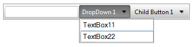

# Templates Overview


## 

**RadToolBar** items are extremely configurable. In addition to the preset [skins](), you can customize the appearance of menu items by [adding custom images](), using [CSS classes](), or [creating custom skins](). However, if you want to embed other HTML controls in a toolbar button, you must use templates. You can embed any content inside an item template, including:

* HTML markup

* ASP.NET server controls

* Other third-party controls (including other Telerik controls)

At design time, add item templates to your **RadToolBar** control using the [Template Design Surface](). **RadToolBar** supports two types of item templates:

1. The global **RadToolBarItem** template affects the appearance of all items in the menu.

1. Individual **Item** templates affect the appearance of a single button, overriding the global **RadToolBarItem** template if it is set.



````ASPNET
<telerik:RadToolBar RenderMode="Lightweight" ID="RadToolBar1" runat="server">
    <Items>
        <telerik:RadToolBarButton runat="server" Text="Button 1" DisplayName="TextBox1">
            <ItemTemplate>
                <input type="text" value='<%# DataBinder.Eval(Container, "Attributes['DisplayName']") %>' />
            </ItemTemplate>
        </telerik:RadToolBarButton>
        <telerik:RadToolBarDropDown runat="server" Text="DropDown 1" DisplayName="DropDown">
            <Buttons>
                <telerik:RadToolBarButton runat="server" Text="Child Button 1" DisplayName="TextBox11">
                    <ItemTemplate>
                        <input type="text" value='<%# DataBinder.Eval(Container, "Attributes['DisplayName']") %>' />
                    </ItemTemplate>
                </telerik:RadToolBarButton>
                <telerik:RadToolBarButton runat="server" Text="Child Button 2" DisplayName="TextBox21">
                    <ItemTemplate>
                        <input type="text" value='<%# DataBinder.Eval(Container, "Attributes['DisplayName']") %>' />
                    </ItemTemplate>
                </telerik:RadToolBarButton>
            </Buttons>
        </telerik:RadToolBarDropDown>
        <telerik:RadToolBarSplitButton runat="server" Text="SplitButton 1" DisplayName="SplitButton">
            <Buttons>
                <telerik:RadToolBarButton runat="server" Text="Child Button 1">
                </telerik:RadToolBarButton>
                <telerik:RadToolBarButton runat="server" Text="Child Button 2">
                </telerik:RadToolBarButton>
            </Buttons>
        </telerik:RadToolBarSplitButton>
    </Items>
</telerik:RadToolBar>
````


If you want the template buttons to reflect the properties of the underlying toolbar button, you must explicitly bind the toolbar button. For details, see [Data-binding expressions]().

>caution If you add templates at runtime, assigning an object that implements the **ITemplate** interface to the **ItemTemplate** property, the template only works with items added at runtime in the code-behind.
>


# See Also

 * [Data Binding Expressions]()

 * [Accessing Controls Inside Templates]()
