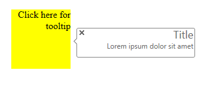

# Right-to-left Support


**RadToolTip** fully supports right-to-left (RTL) language locales. **RadToolTips** are rendered to the page as children of the form element and in order to turn on the RTL support you should set **dir=rtl to the html or body** elements.

````CSS
html
{
    direction: rtl;
}
````


````ASP.NET
<telerik:RadToolTip RenderMode="Lightweight" runat="server" ID="RadToolTip1" Width="200px" Height="50px" ShowEvent="OnClick"
    HideEvent="ManualClose" Title="Title" Text="Lorem ipsum dolor sit amet" RelativeTo="Element"
    Position="MiddleRight" TargetControlID="target" IsClientID="true">
</telerik:RadToolTip>
<div id="target" style="position: absolute; top: 300px; left: 300px; width: 100px; height: 100px; background-color:Yellow;">
    Click here for tooltip
</div>
````



# See Also

 * [See this live in an online demo](https://demos.telerik.com/aspnet-ajax/tooltip/examples/righttoleft/defaultcs.aspx)
