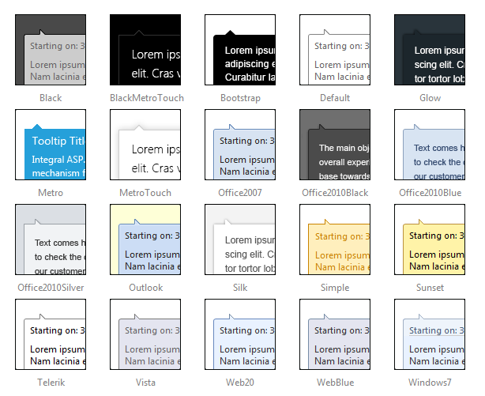

# Skins

## 

To make customizing the appearance of __RadToolTip__and __RadToolTipManager__as easy as possible, these controls use __skins.__ A skin is a set of images and a CSS stylesheet that are applied to the HTML elements which make up the tooltip, defining the look and feel.

To apply a skin, set the __Skin__ property of the __RadToolTip__or __RadToolTipManager__control. You can set the __Skin__ property using the properties pane or the control's [Smart Tag]().

__RadToolTip__is installed with a number of predefined skins:
>caption 

>note The __Hay__ , __Forest__ , __Sitefinity__ and __Transparent__ skins are obsolete and have been removed from the Telerik.Web.UI.Skins.dll assembly as of __Q1 2014__ .	You can find more information on the matter in[this blog post](http://blogs.telerik.com/aspnet-ajax/posts/13-04-11/6-telerik-asp.net-ajax-skins-going-obsolete).
>

# See Also

 * [Smart Tag]()
