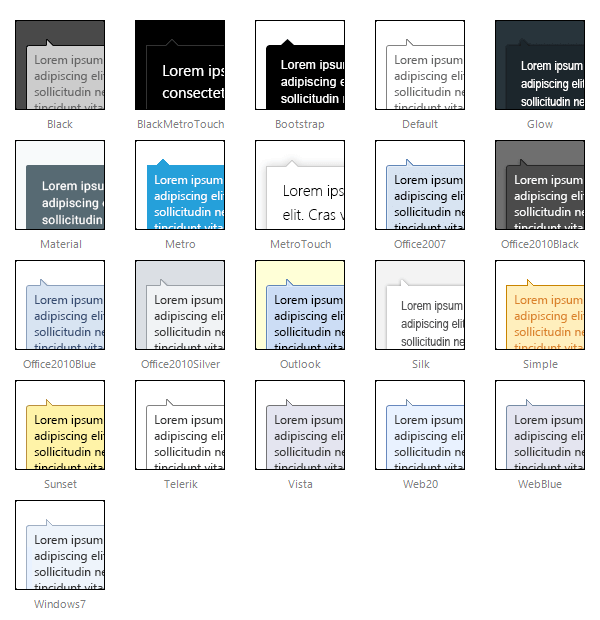

# Skins

To make customizing the appearance of **RadToolTip** and **RadToolTipManager** as easy as possible, these controls use **skins.** A skin is a set of images and a CSS stylesheet that are applied to the HTML elements which make up the tooltip, defining the look and feel.

To apply a skin, set the **Skin** property of the **RadToolTip** or **RadToolTipManager** control. You can set the **Skin** property using the properties pane or the control's [Smart Tag]().

**RadToolTip** is installed with a number of predefined skins:

 

 @[template - Material skin is available only in Lightweight mode](/_templates/common/skins-notes.md#material-only-in-lightweight) 

# See Also

 * [Smart Tag]()
 * [Telerik ThemeBuilder for ASP.NET AJAX](https://themebuilder.telerik.com/)

