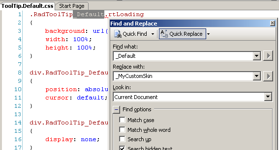
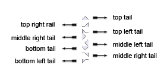
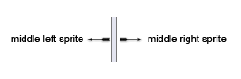
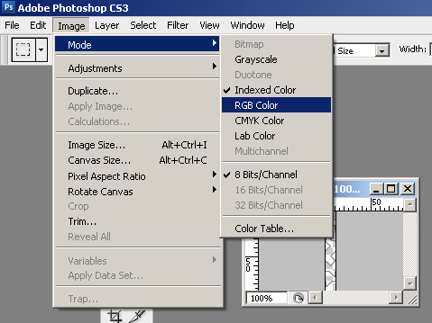
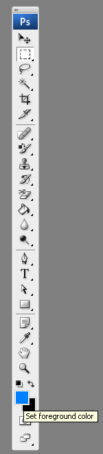
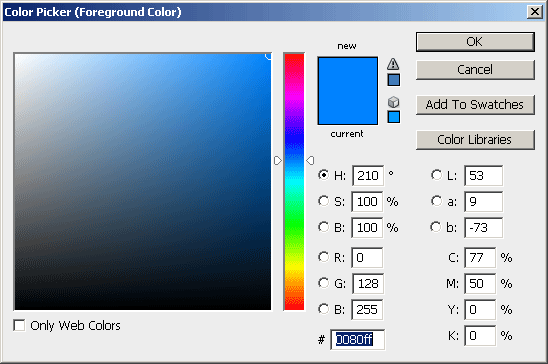
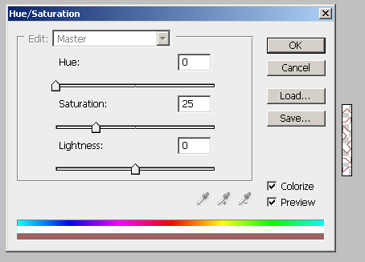

# Tutorial: Creating a Custom Skin

## Creating a Custom Skin for RadToolTip for ASP.NET AJAX from an Existing One

In order to explain better the CSS classes of RadToolTip, we will use ToolTip.SkinName.css as external resources. We will modify an existing skin of RadToolTip. Follow these steps to register an external skin for RadToolTip for ASP.NET AJAX before editing any CSS:

1. In your project, create a new directory named Skins

1. In the Skins folder create a new directory **MyCustomSkin**. 

1. Go to **~/[TelerikControlsInstallationFolder]/Skins/Default** and copy **Tooltip.Default.css** and the **Skins/Default/Tooltip** folder in your Skins folder. 

1. Rename **Tooltip.Default.css** to **Tooltip.MyCustomSkin.css** and the folder **Default** to **MyCustomSkin**. 

1. When you are finished you should have **Skins/MyCustomSkin/Tooltip.MyCustomSkin.css** and **Skins/MyCustomSkin/Tooltip**. The last folder contains the images for **MyCustomSkin**. 

1. In order to support multiple skins of RadTooltip on a single page, the wrapping skin-specific class is coined by the name of the control, RadTooltip plus underscore ("`_`") plus SkinName, i.e. **.RadTooltip_Default**, so in order to create a custom skin out of the Default skin, we should rename all occurrences of "**Default**" in **Tooltip.MyCustomSkin.css** to "**MyCustomSkin**" as shown below:

	

1. Add a new server declaration of RadTooltip on your page, and set Skin="MyCustomSkin" and EnableEmbeddedSkins="false":

	__ASP.NET__

		<telerik:RadToolTip RenderMode="Lightweight" runat="server" ID="RadToolTip1" EnableEmbeddedSkins="false" Skin="MyCustomSkin">
		</telerik:RadToolTip>

1. Register Tooltip.MyCustomSkin.css in the `<head>...</head>` section of your webpage. In order to have the CSS applied correctly, the base stylesheet should come first in the DOM:

	__HTML__

		<link rel="stylesheet" type="text/css" href="Skins/MyCustomSkin/ToolTip.MyCustomSkin.css">
		</link>

	Make sure the path to the files is correct, otherwise the skin will not apply.

1. Reload the page, and if the steps 1-8 have been followed correctly, you will see RadTooltip running a custom Default skin set as an external resource.

## RadToolTip for ASP.NET AJAX CSS: Classes and Their Use

**The Skin Stylesheet - ToolTip.MyCustomSkin.css**

**Main CSS Classes**

* .RadToolTip_MyCustomSkin.rtLoading loading image of RadToolTip

* div.RadToolTip_MyCustomSkin wrapping class

* div.RadToolTip_MyCustomSkin div.rtCallout tooltip tail wrapping class

* div.RadToolTip_MyCustomSkin.rtVisibleCallout div.rtCallout tooltip tail wrapping class

* div.RadToolTip_MyCustomSkin table.rtWrapper wrapping table of the control

* div.RadToolTip_MyCustomSkin table.rtWrapper td.rtWrapperTopLeft, div.RadToolTip_MyCustomSkin table.rtWrapper td.rtWrapperTopRight, div.RadToolTip_MyCustomSkin table.rtWrapper td.rtWrapperBottomLeft, div.RadToolTip_MyCustomSkin table.rtWrapper td.rtWrapperBottomRight tooltip corners

* div.RadToolTip_MyCustomSkin table.rtWrapper td.rtWrapperTopLeft top left corner

* div.RadToolTip_MyCustomSkin table.rtWrapper td.rtWrapperTopRight top right corner

* div.RadToolTip_MyCustomSkin table.rtWrapper td.rtWrapperBottomLeft bottom left corner

* div.RadToolTip_MyCustomSkin table.rtWrapper td.rtWrapperBottomRight bottom right corners

* div.RadToolTip_MyCustomSkin table.rtWrapper td.rtWrapperBottomCenter bottom center

* div.RadToolTip_MyCustomSkin table.rtWrapper td.rtWrapperTopCenter top center

* div.RadToolTip_MyCustomSkin table.rtWrapper td.rtWrapperLeftMiddle,

* div.RadToolTip_MyCustomSkin table.rtWrapper td.rtWrapperRightMiddle left and right middle

* div.RadToolTip_MyCustomSkin table.rtWrapper td.rtWrapperContent content cell

* div.RadToolTip_MyCustomSkin div.rtTitlebar titlebar

* div.RadToolTip_MyCustomSkin a.rtCloseButton close button

## Understanding the Image Sprites

Each skin of RadToolTip consists of three image sprites, that are contained in the Skins/SkinName/RadToolTip folder. These are:

1. Callouts.gif - the images for RadToolTip's buttons, as well as their hover states:

1. ToolTipSprites.gif - the horizontal sprites for the control

1. ToolTipVerticalSprites.gif - the vertical sprites for the control

1. Loading.gif - the loading indicator for the control

Below are visual schemes of the image sprites that are used to skin RadToolTip.

>caption Callouts.gif

>caption ToolTipSprites.gif

>caption CommandButtonSprites.gif

## Modifying the Image Sprites to Achieve Totally New Looks for the Skin

Explained below is a simple method for modifying the image sprites of RadToolTip with Adobe© PhotoShop to achieve new looks without creating a new design.

1. Drag Callouts.gif, ToolTipSprites.gif andCommandButtonSprites.gif in Adobe© PhotoShop

1. From the menu bar select Image » Mode » RGB Color to prepare the images for editing (convert from optimized Indexed Color to RGB Color):

	

1. Press Set Foreground Color in PhotoShop's toolbox to invoke the color picker dialog:

	

1. Select a color that you like from the color dialog and then close it:

	

1. Select Image » Adjustments Hue » / Saturation to open the Hue / Saturation dialog of Adobe© PhotoShop:

	

1. Check the colorize checbox in the Hue / Saturation dialog, and the image you have selected will be immediately colorized in the hue you have selected from the toolbox:

	

	You may then play with the Hue, Saturation and Lightness sliders to fine tune or further modify the image. Make sure you memorize the values of the sliders, as you will need to add the same settings to all three images in order to achieve consistent looks

1. Press "OK" when you are finished

1. Select Image Image » Mode » Indexed Color to flatten the layers of the image

1. Save and close the image

1. Repeat Steps 5 - 9 for each of the remaining images

1. After you are over and done with this, save your work and reload the page. You will have a brand new skin based on Telerik's Default skin of RadToolTip.

	

	

# See Also

* [Skins]()

* [Controlling Appearance]()
