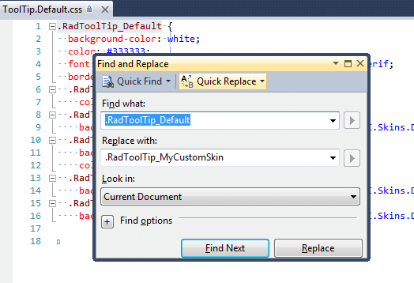

# Tutorial: Creating a Custom Skin

## RadToolTip Custom Skin with LightWeight RenderMode

Each of the controls included in the **Telerik® UI for ASP.NET AJAX** suite is styled with two CSS files that are loaded in a certain order. The first one – **[ControlName].css** , also called base stylesheet, contains CSS properties and values that are common for all skins, i.e it is layout-specific, not skin-specific. These are CSS float, padding, margin, font-size, font-family, etc. In the general case, when creating a custom skin for a control this file should not be edited, unless the custom skin needs different sizes, padding and / or margins. 

 The second file represents the actual skin of the control, and its name consists of the control name plus the skin name, e.g. - **ToolTip.Default.css**. Upon creating a custom skin for the control, one should edit that particular file, as it contains skin-specific CSS properties, and references to images, colors, borders and backgrounds. 

 Since Q2 2013 RadToolTip has a LightWeight render mode, which uses semantically structured HTML and CSS3 for shadows, rounded corners and gradients. Overall, the skinning method is the same as for the Classic mode. The difference is that now there is one common sprite for all Light-Weighted controls called **radActionsSprite.png**. The sprite is placed in the **[SkinName]\Common** folder, e.g.: **[Telerik® UI for ASP.NET AJAX installation folder]\Skins\Default\Common\radActionsSprite.png**


## Creating RadToolTip LightWeight Skin from Existing One


1. In your project, create a new directory named **Skins**


1. In the **Skins** folder if you already have some custom skin, most probably you have already a folder named: **MyCustomSkin** – if you don’t – create one;

1. In the **Skins** folder create a new folder named: **MyCustomSkinLite** - this is the place where your Light-Weight custom skins CSS will be placed;


1. Go to **~/[TelerikControlsInstallationFolder]/Skins/DefaultLite** and copy **Tooltip.Default.css** to your **MyCustomSkinLite** folder. 

1. Go to **[TelerikControlsInstallationFolder]\Skins\Default** and copy **Common** folder in your **MyCustomSkin** folder;


1. Rename **Tooltip.Default.css** to **Tooltip.MyCustomSkin.css**

1. When you are finished you should have the following folder structure in your project:
	* **Skins/MyCustomSkin/Common/** - containing several sprites;
	* **Skins/MyCustomSkinLite/ToolTip.MyCustomSkin.css**.


1. In order to support multiple skins of RadTooltip on a single page, the wrapping skin-specific class is coined by the name of the control, RadTooltip plus underscore ("`_`") plus SkinName, i.e. **.RadTooltip_Default**, so in order to create a custom skin out of the Default skin, we should rename all occurrences of "**Default**" in **Tooltip.MyCustomSkin.css** to "**MyCustomSkin**" as shown below:

	

1. Add a new server declaration of RadTooltip on your page, and set Skin="MyCustomSkin" and EnableEmbeddedSkins="false":

	__ASP.NET__

		<telerik:RadToolTip ID="RadToolTip1" runat="server" IsClientID="true" HideEvent="ManualClose" Position="BottomRight"
					RelativeTo="Element" EnableRoundedCorners="true" TargetControlID="targetElement" EnableShadow="true"
					ShowEvent="OnMouseOver" Width="320px" Height="130px" VisibleOnPageLoad="true">
			<asp:Literal runat="server" ID="ToolTipContent"></asp:Literal>
		</telerik:RadToolTip>


1. Register Tooltip.MyCustomSkin.css in the `<head>...</head>` section of your webpage. In order to have the CSS applied correctly, the base stylesheet should come first in the DOM:

	__HTML__

		<link href="Skins/MyCustomSkin/ToolTip.MyCustomSkin.css" rel="stylesheet" type="text/css" />

1. Make sure the path to the files is correct, otherwise the skin will not apply.

1. To complete the customization, you will need to change the **RadToolTip** sprites color according to your needs. Open **[TelerikControlsInstallationFolder]\Skins\Default\ToolTip\Callouts.gif** and **[TelerikControlsInstallationFolder]\Skins\Default\ToolTip\ToolTipSprites.gif** edit it as required.

1. Reload the page, and if the steps 1-12 have been followed correctly, you will see **RadToolTip** running a custom Default skin set as an external resource.


## RadToolTip LightWeight Custom Skin Example

Below is shown how to modify the CSS in order not only to change some colors and background colors, but also some base layout settings such as font size, element height, border-radius etc.

````ASP.NET
<!DOCTYPE html PUBLIC "-//W3C//DTD XHTML 1.0 Transitional//EN" "http://www.w3.org/TR/xhtml1/DTD/xhtml1-transitional.dtd">
<html xmlns="http://www.w3.org/1999/xhtml">
<head runat="server">
    <title></title>
    <style type="text/css">
        .RadToolTip.RadToolTip_MyCustomSkin,
        .RadToolTip.RadToolTip_MyCustomSkin .rtContent {
            background-color: #e6e5fb;
        }

        .RadToolTip.RadToolTip_MyCustomSkin.rtShadow {
            box-shadow: 4px 5px 6px #aaa9eb;
        }

        .RadToolTip.RadToolTip_MyCustomSkin {
            border-color: #aaa9eb;
            border-width: 2px;
        }

        .RadToolTip.RadToolTip_MyCustomSkin.rtRoundedCorner {
            border-radius: 8px;
        }
    </style>
</head>
<body>
    <form id="form1" runat="server">
    <asp:ScriptManager ID="sm1" runat="server" />
    <asp:Image ID="imgStatus" runat="server" Style="width: 100px; height: 100px; display: block;
        color: #000; margin: 100px auto; border: 1px solid red;" />
    <telerik:RadToolTipManager ID="ttmInstallStatus" OffsetY="-1" HideEvent="ManualClose"
        ShowEvent="OnMouseOver" Width="400" Height="140" runat="server" RelativeTo="Element"
        Position="BottomCenter" EnableShadow="true" ShowCallout="true" 
        OnAjaxUpdate="ttmInstallStatus_AjaxUpdate" Title="Title" EnableEmbeddedSkins="false" Skin="MyCustomSkin" RenderMode="Lightweight">
        <TargetControls>
            <telerik:ToolTipTargetControl TargetControlID="imgStatus" Value="Apple" />
        </TargetControls>
    </telerik:RadToolTipManager>
    </form>
</body>
</html>
````

````C#
protected void ttmInstallStatus_AjaxUpdate(object sender, ToolTipUpdateEventArgs e)
{
    System.Threading.Thread.Sleep(2000);
    e.UpdatePanel.ContentTemplateContainer.Controls.Add(new LiteralControl(DateTime.Now.ToString()));
}
````
````VB
Protected Sub ttmInstallStatus_AjaxUpdate(sender As Object, e As ToolTipUpdateEventArgs)
    System.Threading.Thread.Sleep(2000)
    e.UpdatePanel.ContentTemplateContainer.Controls.Add(New LiteralControl(DateTime.Now.ToString()))
End Sub
````


# See Also

* [Skins]()

* [Controlling Appearance]()

* [Telerik ThemeBuilder for ASP.NET AJAX](http://themebuilder.telerik.com/)


