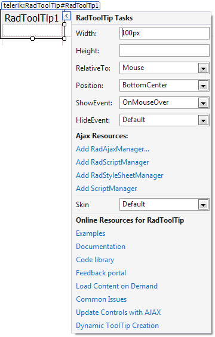

# Smart Tag

The Smart Tags for __RadToolTip__and __RadToolTipManager__are identical. They all let you easily change the skin for your control or quickly get help. You can display the Smart Tag by right clicking on a __RadToolTip__and __RadToolTipManager__control and choosing "Show Smart Tag", or clicking the small rightward-pointing arrow located in the upper right corner of the control.
>caption 

## Ajax Resources

* __Add RadAjaxManager...__ adds a __RadAjaxManager__ component to your Web page, and displays the __r.a.d.ajax Property Builder__ where you can configure it.

* __Add RadStyleSheetManager__ adds a __RadStyleSheetManager__ to your Web page.

## Skin

The __Skin__ drop-down displays a list of available [skins]() that you can apply to your control, along with an example of what the tool tips look like for each skin. Assign a skin by selecting from the list.

## Learning Center

* Links navigate you directly to examples, help, and code library.

* You can navigate directly to the [Telerik Support Center](http://www.telerik.com/support/home.aspx).

# See Also

 * [Skins]()
