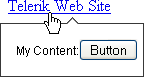

# Template Editor


The template editor appears as the lower area in the RadToolTip at design-time. You can drag controls from the toolbox to the RadToolTip Template Editor:


Elements placed in the template editor will show up within the ASP.NET markup RadToolTip tags:

````ASP.NET
<telerik:RadToolTip RenderMode="Lightweight" ID="RadToolTip1" runat="server" TargetControlID="HyperLink1"
	        Position="BottomCenter">
	My Content:<asp:Button ID="Button1" runat="server" Text="Button" />
</telerik:RadToolTip>
````


The template content will display in the tooltip at runtime:




# See Also

 * [Managing Content]()
