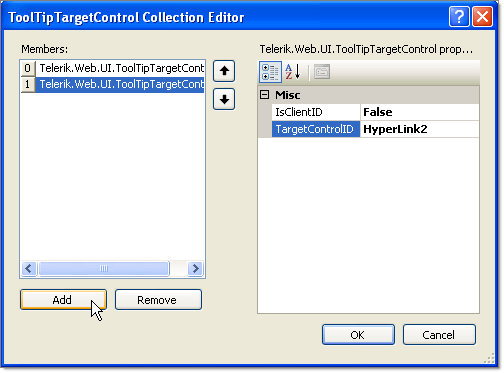

# ToolTipTargetControl Collection Editor

The **ToolTipTargetControl Collection Editor** lets you add **ToolTipTargetControl** elements to a **TargetControls** collection. Each item added to this list specifies the id of a target control and whether the ID is a ClientID. To display the **ToolTipTargetControl Collection Editor**, click on the ellipsis button for the **TargetControls** collection of the **RadToolTipManager** control.

* Click the **Add** button to append a new tool tip target control to the collection.

* Use the up and down arrow buttons to rearrange the tool tip targets in the collection.

* Select a tool tip target control and click the **Remove** button to delete it from the list.

* Select individual tool tip target controls to change the TargetControlID or IsClientID properties.

# See Also

 * [Overview]()

 * [Using the TargetControls Collection]()
