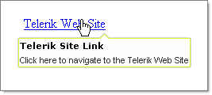

# First Steps with RadToolTip

The following tutorial demonstrates how **RadToolTip** is used to provide a custom tooltip for a single element.

1. In a new AJAX-Enabled Web Application, add a **HyperLink** control from the Standard tab to the default web page.

1. Set the **Text** property to "Telerik Web Site" and the **NavigateUrl** to "https://www.telerik.com".

1. Drop a **RadToolTip** control from the ToolBox to the default web page.

1. Set the RadToolTip **TargetControlID** property to the ID property of the HyperLink.

1. Set the **Position** property to be **BottomCenter**.

1. Set the **Title** property to "Telerik Site Link".

1. Set the **Text** property to "Click here to navigate to the Telerik Web Site".

1. Set the **Skin** property to **Telerik**.

1. Press **F5** to run the application. Run the mouse over the HyperLink to view the tooltip.

# See Also

 * [FIrst Steps with RadToolTipManager]()
