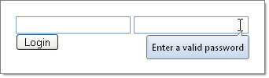

# FIrst Steps with RadToolTipManager

The following tutorial demonstrates how **RadToolTipManager** is used to provide a common look and feel for multiple elements. See [RadToolTipManager Overview]() for more more uses of this control.

In a ne1. w AJAX-Enabled Web Application, add two **TextBox** controls and one **Button** from the Standard tab to the default web page.

1. In the first textbox, set the **ToolTip** property to "Enter your valid login name".
 
1. In the second textbox, set the **ToolTip** property to "Enter a valid password".
 
1. Set the Button **Text** property to "Login" and the **ToolTip** property to "Click this button to login to the system".
 
1. Add a **RadToolTipManager** control to the page and set **AutoTooltipify="true"**.
 
1. Set the **Skin** property to **Office2007**.
 
1. Press **F5** to run the application. Run the mouse over the textboxes and button to activate the tooltips. You will notice that the tooltips have the Office2007 style and that the contents for the tooltips are automatically picked up from the standard ToolTip property.

# See Also

 * [First Steps with RadToolTip]()

 * [Load Content On Demand]()
