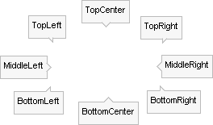
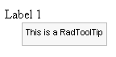
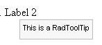

# Positioning


To precisely position the tooltip, use the following **RadToolTip** and **RadToolTipManager** properties:

* **Position:** defines the relative location where the ToolTip will appear and can be one of the following values: BottomCenter, BottomLeft, BottomRight, Center, MiddleLeft, MiddleRight, TopCenter, TopLeft, TopRight. Notice in the screenshot below that the [callout]() points in relation to the tooltip position.

	

* **RelativeTo**: defines which element the ToolTip will appear in relation to. The possible values are **Mouse** (the default), **Element** and **BrowserWindow**.

* **OffsetX, OffsetY:** sets the X and Y offsets from the **Position** property of the ToolTip. These properties can be used for a more precise positioning of the ToolTip. The default values are zero.

## Example

The wide range of properties used to configure where the ToolTip will appear on the page, lead to a wide range of possible configurations. The following example demonstrates one possible configuration of RadToolTip and the identical settings with RadToolTipManager:

````ASP.NET
<telerik:RadToolTip RenderMode="Lightweight" ID="RadToolTip1" runat="server" TargetControlID="Label1" ShowCallout="false"
    RelativeTo="Element" Position="BottomRight" OffsetY="-10" OffsetX="-10" Text="This is a RadToolTip">
</telerik:RadToolTip>
<asp:Label ID="Label1" runat="server" Text="Label 1"></asp:Label>
<telerik:RadToolTipManager
    ID="RadToolTipManager1" runat="server" ShowCallout="false" RelativeTo="Element"
    Position="BottomRight" OffsetY="-10" OffsetX="-10" Text="This is a RadToolTip">
    <TargetControls>
        <telerik:ToolTipTargetControl TargetControlID="Label2" />
    </TargetControls>
</telerik:RadToolTipManager>
<asp:Label ID="Label2" runat="server" Text="Label 2"></asp:Label>
````


The resulting display of the ASP.NET above:


 



# See Also

 * [Important Settings]()

 * [RadToolTip Structure]()
