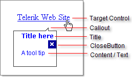

# RadToolTip Structure

The main visual elements of RadToolTip are:
 

* **Target Control**: This is not a part of the tooltip, but the element that the tooltip appears in relation to.

* **Callout**: This is the arrow that points towards the target control.

* **Title**: The title text area at the top of the tool tip.

* **CloseButton**: The button that appears on the tooltip if the **ManualClose** property is **True**.

* **Content** or **Text**: This is the lower part of the control. It can be customized using **Text** property or by declaring the content that appears between the **RadToolTip** tags in ASP.NET. Content can also be specified by setting the ToolTip or Title attribute of a target control.

# See Also

 * [Important Settings]()
