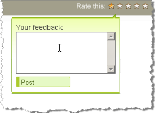

# Sticky Tooltips

## 

Use "sticky" functionality when the tooltip should behave like a menu, dropdown, or a context menu. It prevents the tooltip from hiding when the mouse moves away from the target element and tooltip, so content in the tooltip itself can be selected. The tooltip will close when the mouse moves out of the target element and out of the tooltip itself.

To make the RadToolTip sticky, set the __HideEvent="LeaveToolTip"__.
>caption 

>tip In addition, setting __AutoCloseDelay__ to __0__ will prevent the tooltip from hiding after an interval. If this is done the tooltip will hide only if another tooltip must be shown or if its hide() method is called explicitly. It is similar to setting HideEvent to ManualClose but without the [x] button.
>

# See Also

 * [Important Settings]()
