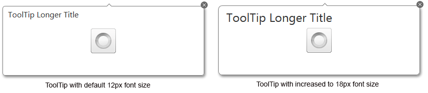

# Responsive, Adaptive and Elastic Capabilities


This article explains the __responsive design capabilities RadTooltip offers__.	The [Lightweight RenderMode]() of RadTooltip supports	__elastic design since Q3 2013__.

Generally, responsive design means that the page and its content are able to adapt to different screen resolutions without deteriorating	the user experience. This often includes changing the font size and having dimensions set in percent.

## Elastic Design with RadTooltip
>caption Figure 1: Comparison between appearance of a RadTooltip with regular font size and with increased font size



__RadTooltip__ does not create elastic design by itself, but can fit in a pagethat follows this pattern. This means that RadTooltip does not support dimensions set in percent,but its __Lightweight RenderMode__ supports __changing the font size__without breaking the control's appearance - if the new size is larger than the original,the elements in the control will simply increase their size as well to accommodate the text.This fluid layout is achieved by using `em` units for setting dimensions and paddings in the control, instead of `px`because `em` units are tied to the font size. This allows dimensions and sizes to scale with the font size.

Elements that use images or images sprites, however, cannot be increased in size, so the commands will keep having their original dimensions and position(aligned to the top right corner).

The following sample shows how to increase the font size of a RadTooltip and the effect can be seen in comparison in Figure 1.

````ASPNET
		<style type="text/css">
			div.RadToolTip
			{
				font-size: 18px;
			}
		</style>
		<asp:Image ID="imgStatus" runat="server" Style="width: 100px; height: 100px; display: block; color: #000; margin: 100px auto; border: 1px solid red;" />
		<telerik:RadToolTipManager ID="ttmInstallStatus" OffsetY="-1" HideEvent="ManualClose"
			ShowEvent="OnMouseOver" Width="400" Height="140" runat="server" RelativeTo="Element"
			Position="BottomCenter" EnableShadow="true" ShowCallout="true"
			Title="ToolTip Longer Title" EnableEmbeddedSkins="true" RenderMode="Lightweight">
			<TargetControls>
				<telerik:ToolTipTargetControl TargetControlID="imgStatus" Value="Apple" />
			</TargetControls>
		</telerik:RadToolTipManager>
````


# See Also

 * [Render Modes]()
