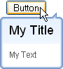
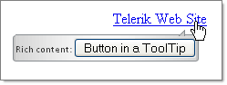

# Managing Content


## 

The __RadToolTip__ exposes the server-side __Title__ property, which can be used to set an overall title for the tooltip that is separate from the rest of the content. It is always displayed, regardless of the other content that is shown and the method that set it.
>caption 



>tabbedCode

````C#
	
			RadToolTip1.Text = "My Text"; 
			RadToolTip1.Title = "My Title";
	
````


````VB.NET
	
	        RadToolTip1.Text = "My Text"
	        RadToolTip1.Title = "My Title"
	
````


>end


Content can be added to __RadTooltip__ in multiple ways and is displayed in the below listed order of precedence. This means that if the first is not available the next one is tried until content is found.

1. Setting the __Text__ property:

>tabbedCode

````C#
	
	
			RadToolTip1.Text = "Clicking this link navigates to the Telerik web site";
	
````


````VB.NET
	
	        RadToolTip1.Text = "Clicking this link navigates to the Telerik web site"
	
````


>end

1. Content from the __ToolTip__ property of the target control. It renders as the __title__ property. Images supply the __AlternateText__ and __alt__ properties in ASP.NET and HTML respectively.

>tip You can use the __IgnoreAltAttribute__ to instruct the __RadToolTip__ to ignore the AlternateText and alt properties and not remove them from its target element. This will result in a change of the content source priorities for images and a second tooltip being shown under IE6 and IE7, as these browsers interpret the alt attribute like the title attribute.
>
The following code snippet will show the __AlternateText__ as a content in the tooltip, despite the existence of markup in the tooltip itself. You can set the __IgnoreAltAttribute__ to true and see how the behavior changes:

````ASPNET
	    <asp:Image runat="server" ID="Image1" AlternateText="the alternate text" Width="100px" Height="100px" />
	    <telerik:RadToolTip runat="server" ID="RadToolTip1" TargetControlID="Image1" IsClientID="false"
	        ShowEvent="OnMouseOver" HideEvent="Default" Position="BottomRight" RelativeTo="Mouse"
	        Width="100px" Height="50px" Title="title">
	        <asp:Label ID="Label1" Text="text within the tooltip declaration" runat="server" />
	    </telerik:RadToolTip>
````


1. Content from the controls collection has the lowest priority. The content is supplied from whatever is specified between the opening and closing tags of the tooltip or set in Controls collections in the codebehind.
>caption 



````ASPNET
	    <telerik:RadToolTip ID="RadToolTip1" Skin="Inox" runat="server" TargetControlID="HyperLink1">
	        Rich content:
	        <asp:Button ID="btnA" runat="server" Text="Button in a ToolTip" />
	    </telerik:RadToolTip>
````


>tabbedCode

````C#
	
			RadToolTip1.Controls.Add(new LiteralControl("Rich content:"));
			Button button = new Button(); 
			button.ID = "btnA";
			button.Text = "Button in a ToolTip";
			RadToolTip1.Controls.Add(button);
	
````


````VB.NET
	
	        RadToolTip1.Controls.Add(New LiteralControl("Rich content:"))
	        Dim button As New Button()
	        button.ID = "btnA"
	        button.Text = "Button in a ToolTip"
	        RadToolTip1.Controls.Add(button)
	
````


>end

>tip You can also add large amounts of content dynamically using the[RadToolTipManager OnAjaxUpdate]()event.
>


# See Also

 * [Using the TargetControlID Property]()
