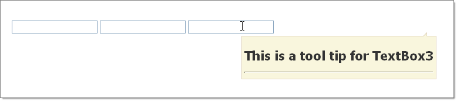

# Load Content On Demand


**RadToolTipManager** offers two ways to load the content of the tooltips - via an AJAX request and from a WebService.	This article shows how you can use both and how you can cache data in the tooltips:

* [AJAX request (partial page rendering)](#loading-content-with-ajax)

* [WebService](#loading-content-via-a-webservice)

	* [ASMX WebService](#asmx-webservice)
	
	* [WCF WebService](#wcf-webservice)

* [Caching the data](#caching-the-loaded-content)

## Loading Content with AJAX

The **OnAjaxUpdate** event fires when the user moves the mouse over a particular 'tooltipified' element on the client. The event is useful for load-on-demand scenarios where the data needs to come from the server, needs to be loaded from a database or where particularly large amounts of data are involved.

The event passes a **ToolTipUpdateEventArgs** to the handler with properties:

* **TargetControlID**: Identifies the control for which the a RadToolTip is about to open.

* **UpdatePanel**: A reference to an UpdatePanel from which the callback is initiated. The UpdatePanel is positioned in the RadToolTip and holds the content.

In the example below, HTMLGenericControls are created and populated with an HTML "Header 1" tag and a "Horizontal Rule" tag.





````C#	
protected void RadToolTipManager2_AjaxUpdate(object sender, Telerik.Web.UI.ToolTipUpdateEventArgs e)
{
	HtmlGenericControl htmlGenericControl = new HtmlGenericControl("H1");
	htmlGenericControl.InnerText = "This is a tool tip for " + e.TargetControlID;
	e.UpdatePanel.ContentTemplateContainer.Controls.Add(htmlGenericControl);
	e.UpdatePanel.ContentTemplateContainer.Controls.Add(new HtmlGenericControl("HR"));
}
	
````
````VB
Protected Sub RadToolTipManager2_AjaxUpdate(ByVal sender As Object, ByVal e As Telerik.Web.UI.ToolTipUpdateEventArgs)

    Dim htmlGenericControl As New HtmlGenericControl("H1")
    htmlGenericControl.InnerText = "This is a tool tip for " + e.TargetControlID
    e.UpdatePanel.ContentTemplateContainer.Controls.Add(htmlGenericControl)
    e.UpdatePanel.ContentTemplateContainer.Controls.Add(New HtmlGenericControl("HR"))
End Sub
````


## Loading Content via a WebService

When a tooltip controlled by the **RadToolTipManager** needs to be shown a call to the WebService is made. This should return a string (which may contain HTML, which will be rendered) and its value is passed to the tooltip. The path to the WebService and the name of the service method are specified in the **WebServiceSettings** inner tag's **Path** and **Method** properties. You can find examples below.

>note WebServices return simple strings and even though they can contain HTML, they are not rendered by the ASP engine.	This means that script controls like the Telerik® UI for ASP.NET AJAX	controls *cannot* be used in the content (e.g., user control) that is returned from the service call.
>


### ASMX WebService

````ASP.NET
<telerik:RadToolTipManager RenderMode="Lightweight" ID="RadToolTipManager1" runat="server" EnableShadow="true" Position="BottomCenter"
    Animation="Fade" Width="415px" Height="250px" elativeTo="Element">
    <WebServiceSettings Method="GetToolTipData" Path="ToolTipWebService.asmx" />
</telerik:RadToolTipManager>
````


The WebService itself needs to have the following signature (including the parameter name - *context*):


````C#
[ScriptService]
public class WebServiceName : WebService
{
    [WebMethod]
    public string WebServiceMethodName(object context)
    {
        // We cannot use a dictionary as a parameter, because it is only supported by script services.
        // The context object should be cast to a dictionary at runtime.
        IDictionary<string, object> contextDictionary = (IDictionary<string, object>)context;

        //how to use the dictionary:
        //get the value associated with the target control
        string tooltipValue = ((string)contextDictionary["Value"]);
        //gets the target control's ID
        string targetID = ((string)contextDictionary["TargetControlID"]);

        //...
    }
}
````
````VB
<ScriptService()> _
Public Class WebServiceName
    Inherits WebService
    <WebMethod()> _
    Public Function WebServiceMethodName(context As Object) As String
        ' We cannot use a dictionary as a parameter, because it is only supported by script services.
        ' The context object should be cast to a dictionary at runtime.
        Dim contextDictionary As IDictionary(Of String, Object) = DirectCast(context, IDictionary(Of String, Object))

        'how to use the dictionary:
        'get the value associated with the target control
        Dim tooltipValue As String = (DirectCast(contextDictionary("Value"), String))
        'gets the target control's ID
        Dim targetID As String = (DirectCast(contextDictionary("TargetControlID"), String))

        '...
    End Function
End Class
````


### WCF WebService

````ASP.NET
<telerik:RadToolTipManager RenderMode="Lightweight" ID="RadToolTipManager2" runat="server" Poosition="BottomCenter" Hideevent="ManualClose"
	Animation="Fade" Width="430px" Height="250px" RelativeTo="Element">
	<WebServiceSettings Method="GetCustomerInfo" Path="TooltipWcfService.svc"></WebServiceSettings>
</telerik:RadToolTipManager>
````


The WCF WebService itself needs to have the following signature:


````C#
[ServiceContract(Namespace = "")]
[AspNetCompatibilityRequirements(RequirementsMode = AspNetCompatibilityRequirementsMode.Allowed)]
public class TooltipWcfService
{
    [OperationContract]
    public string GetCustomerInfo(ToolTipContext context)
    {
     string theValue = context.Value; 
     string theTargetId = context.TargetControlID; 
     return "the desired content" ;
    }
}
````
````VB.NET
<ServiceContract([Namespace]:="")> _
<AspNetCompatibilityRequirements(RequirementsMode:=AspNetCompatibilityRequirementsMode.Allowed)> _
Public Class TooltipWcfService
	<OperationContract> _
	Public Function GetCustomerInfo(context As ToolTipContext) As String
		Dim theValue As String = context.Value
		Dim theTargetId As String = context.TargetControlID
		Return "the desired content"
	End Function
End Class
````


Where the context object is the following:


````C#
[Serializable]
public class ToolTipContext : Dictionary<string, object>
{
    public string Value
    {
        get { return (string)this["Value"]; }
        set { this["Value"] = value; }
    }
 
    public string TargetControlID
    {
        get { return (string)this["TargetControlID"]; }
        set { this["TargetControlID"] = value; }
    }
}
````
````VB
<Serializable> _
Public Class ToolTipContext
	Inherits Dictionary(Of String, Object)
	Public Property Value() As String
		Get
			Return DirectCast(Me("Value"), String)
		End Get
		Set(value As String)
			Me("Value") = value
		End Set
	End Property

	Public Property TargetControlID() As String
		Get
			Return DirectCast(Me("TargetControlID"), String)
		End Get
		Set(value As String)
			Me("TargetControlID") = value
		End Set
	End Property
End Class
````


## Caching the Loaded Content

Since Q2 2012 the **RadToolTipManager** offers a property to facilitate caching - **EnableDataCaching**. It defaults to `false` to preserve the old behavior - a request is made for the content each time a tooltip is shown, including subsequent showings of the same tooltip.

When **EnableDataCaching** is set to **true**, caching is enabled and only one request will be performed for each target, regardless of how many times the tooltip will be shown.

This can be useful in scenarios where the content that is loaded will not changeover time, e.g. static details about a product. This allows the initial page load to be quick, because all the data for the tooltips will not be retrieved at this point, yet in the same time prevents excessive requests for the same data which can reduce the server load.

You can see it in action in the [ToolTip - Cache Loaded Data](http://demos.telerik.com/aspnet-ajax/tooltip/examples/enabledatacaching/defaultcs.aspx) online demo.

>important  When data caching is enabled **only simple HTML** content is supported for the tooltips.	This means that **controls that rely on postbacks and Telerik controls cannot be put** in the content.	There are several reasons for this:
* The instance of the loaded user control on the server is the last one	that was requested. Therefore postbacks should not occur inside because they may be coming from	a tooltip that is cached, so the data on the server will no longer match what the tooltip will expect.	Should updates be necessary - caching can be disabled through JavaScript so requests start anew: `tooltipTipManagerReference.set_enableDataCaching(false);` can be used.
* Only the HTML string of the content is preserved (i.e. cached), so all event handlers and ScriptControl instances	are going to be lost. The next time this HTML string is shown the styling may appear correctly but the	Telerik controls (or any script controls) will not work (e.g. a RadRotator will not rotate even on click of its buttons).
>

# See Also

 * [Overview]()

 * [Using the TargetControls Collection]()

 * [Using RadToolTipManager in MS AJAX UpdatePanels]()
