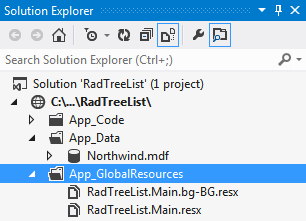
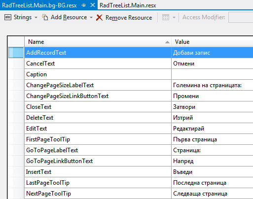
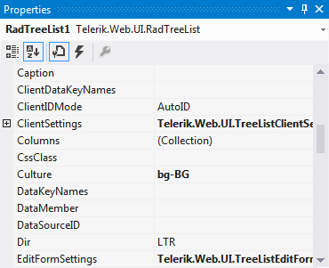

# Localization

The RadTreeList control supports built-in localization through Global resources.Similar to RadGrid, RadEditor and RadScheduler,you can use the resx files to localize the control with minimum efforts.

## Global Resource Files

The primary means for localization in ASP.NET is to use resource files. Resource files are simple XML files that can be easily edited and transferred to otherapplications. You can use resource files to change the default (English) localization for RadTreeList that is stored in the Telerik.Web.UI assembly.

>tip RadTreeList's default **Culture** is taken from the page's **CurrentUICulture** .
>

To create a global resource file to localize the treelist:

1. Create the **App_GlobalResources** folder in the root of your web application.

1. Copy the default resource **RadTreeList.Main.resx** file into it. This file can be found in the App_GlobalResources folder of the directory where you installed the UI controls.

1. Make a copy of the file and rename the copy so that its name contains the Culture Identifier. The resource files used by RadTreeList follow a strict naming convention: **RadTreeList.Main.<Culture Identifier>.resx**

	>tip  **The Culture Identifier consists of a language codefollowed by a dash and the country code.Example: “en-US”, “fr-CA”, “bg-BG” and so on.** 
	>

	For example RadTreeList.Main.bg-BG.resx. Both files should be present in the App_GlobalResources folder:
	

1. The resource files are represented in a human-readible format (XML) and can be easily modified either in the built-in Visual Studio resource editor or directly in the file, by hand.

>caution Make sure that the ReservedResource message is preserved. It is used foridentification purposes and is never displayed.
>

You can now switch the treelist so that it uses your new resource file by setting the active culture:

