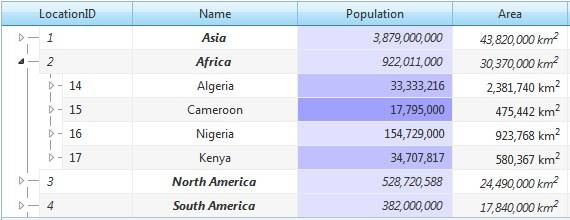

# Conditional Formatting


## 

__RadTreeList__ provides the option to conditionally modify the appearance ofa given elements. For example, it might be convenient to change the background of the cells that containnegative values.

The following example shows how to handle the __ItemDataBound__ event inorder to apply a custom color/decoration to RadTreeList cell/row.


````C#
	    protected void RadTreeList1_ItemDataBound(object sender, TreeListItemDataBoundEventArgs e)
	    {
	        if (e.Item is TreeListDataItem)
	        {
	            TreeListDataItem item = e.Item as TreeListDataItem;
	            int locationId = (int)DataBinder.Eval(item.DataItem, "LocationID");
	            if (locationId < 8)
	            {
	                item.Font.Italic = true; //Row formatting            
	                item["LocationName"].Font.Bold = true; //Cell formatting        
	            }
	        }
	    }			
````
````VB.NET
	
	    Protected Sub RadTreeList1_ItemDataBound(ByVal sender As Object, ByVal e As TreeListItemDataBoundEventArgs) Handles RadTreeList1.ItemDataBound
	        If TypeOf e.Item Is TreeListDataItem Then
	            Dim item As TreeListDataItem = TryCast(e.Item, TreeListDataItem)
	            Dim locationId As Integer = CInt(DataBinder.Eval(item.DataItem, "LocationID"))
	            If locationId < 8 Then
	                item.Font.Italic = True  'Row formatting         
	                item("LocationName").Font.Bold = True 'Cell formatting     
	            End If
	        End If
	    End Sub
	
````




You can examine our online demo below:

[RadTreeList Conditional formatting demo](http://demos.telerik.com/aspnet-ajax/treelist/examples/appearance/conditionalformatting/defaultcs.aspx)
