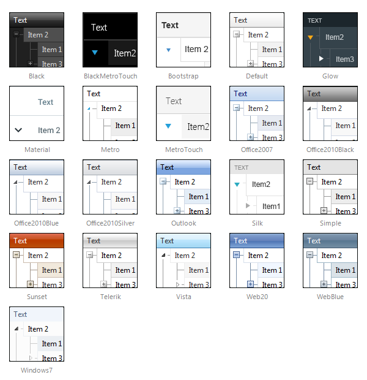

# Skins

RadTreeList uses skins to control its overall look-and-feel. A skin is a set of images and a CSS stylesheet that can be applied to the control elements (items, images, etc.) and defines their look and feel. By default all controls in UI for ASP.NET AJAX suite have a polished look and feel which is consistent across the whole product line.

## Built-in skins

These are the skins provided by Telerik. They are embedded in the Telerik.Web.UI.dll assembly as web resources. To use a built-in skin the user only needs to set the **Skin** property of the control. Built-in skins are also provided in "C:\Program Files\Progress\UI for ASP.NET AJAX RX YYYY\Skins".

Below is a set of the Telerik RadTreeList skins:
 

 @[template - Material skin is available only in Lightweight mode](/_templates/common/skins-notes.md#material-only-in-lightweight) 

>note With Q2 2011 release of UI for ASP.NET AJAX RadTreeList has four new skins (Transparent + Office2010 variations). To use them you should add the Telerik.Web.UI.Skins assembly to your Bin folder. For more information refer to [this blog post](https://blogs.telerik.com/aspnet-ajax/posts/11-07-05/new-telerik-ajax-skins-assembly.aspx).
>Since Q3 2011 all the built-in skins (except the Default one) have been relocated to the Telerik.Web.UI.Skins.dll assembly.Also new Metro skin has been added for RadTreeList.
>Since Q1 2013 three new skins have been added for RadTreeList(BlackMetroTouch, Glow and Silk).
>

## Custom skins

These are skins created by the developer. They are not embedded so the control cannot register them automatically. If you use a custom skin you need to set the **Skin** property, and the **EnableEmbeddedSkins** property of the treelist control to **false**. If you do not do so, an exception will be thrown saying that there is no embedded skin matching the Skin property.

Examine the [Creating a custom skin]() help topic for additional information.

## See Also

 * [Telerik ThemeBuilder for ASP.NET AJAX](https://themebuilder.telerik.com/)

