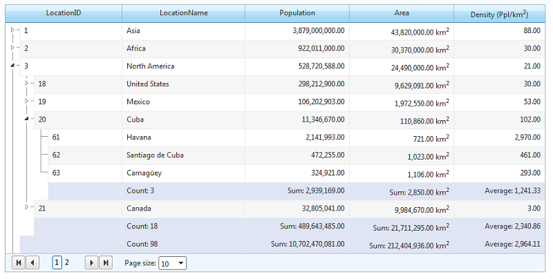

# Aggregates


**RadTreeList** provides the possibility to display column aggregates.The calculated total values are displayed in the footer item at the end of each level.

## 

Below you can find a list of the available aggregate functions:

* Avg

* Count

* CountDistinct

* First

* Last

* Max

* Min

* Sum

You can set the **Aggregate** property of a bound column to the function that youwant to be used in calculating the aggregated value. Then just set **ShowFooter="true"** in the RadTreeList declaration tostart showing aggregates. A footer will appear at the bottom of each level in the treelist showing the totals from theitems in this level. The footer at the root level shows the aggregated values for all items inside the control's [resolved datasource]().

You can also specify the **FooterAggregateFormatString** property of the treelist column in orderto format the text describing the total displayed in the footer.

Here follows example treelist declaration using the above mentioned properties:

````ASPNET
<telerik:RadTreeList RenderMode="Lightweight" ID="RadTreeList1" runat="server" DataSourceID="SqlDataSource1"
AutoGenerateColumns="false" ParentDataKeyNames="ParentLocationID" AllowPaging="true"
PageSize="10" DataKeyNames="LocationID" AllowSorting="true" ShowFooter="true">
<HeaderStyle HorizontalAlign="Center" />
<Columns>
	<telerik:TreeListBoundColumn DataField="LocationID" UniqueName="LocationID" HeaderText="LocationID">
		<HeaderStyle Width="120px" />
	</telerik:TreeListBoundColumn>
	<telerik:TreeListBoundColumn DataField="LocationName" UniqueName="LocationName" HeaderText="LocationName"
		Aggregate="Count" FooterAggregateFormatString="Count: {0}">
		<HeaderStyle Width="200px" />
	</telerik:TreeListBoundColumn>
	<telerik:TreeListNumericColumn DataField="Population" UniqueName="Population" HeaderText="Population"
		HeaderStyle-Width="170px" DataFormatString="{0:n}" Aggregate="Sum" DataType="System.Double"
		FooterAggregateFormatString="Sum: {0:n}">
		<ItemStyle HorizontalAlign="Right" />
	</telerik:TreeListNumericColumn>
	<telerik:TreeListNumericColumn DataField="Area" UniqueName="Area" HeaderText="Area"
		Aggregate="Sum" HeaderStyle-Width="170px" DataFormatString="{0:n} km<sup>2</sup>"
		DataType="System.Double" FooterAggregateFormatString="Sum: {0:n} km<sup>2</sup>">
		<ItemStyle HorizontalAlign="Right" />
	</telerik:TreeListNumericColumn>
	<telerik:TreeListCalculatedColumn DataFields="Area, Population" Expression="{1} / {0}"
		HeaderText="Density (Ppl/km<sup>2</sup>)" DataFormatString="{0:n}" Aggregate="Avg"
		FooterAggregateFormatString="Average: {0:n}">
		<ItemStyle HorizontalAlign="Right" />
	</telerik:TreeListCalculatedColumn>
	<telerik:TreeListBoundColumn DataField="ParentLocationID" UniqueName="ParentLocationID"
		Visible="false" HeaderText="ParentLocationID" />
</Columns>
</telerik:RadTreeList>
````


The result from these settings would look like this:


# See Also

 * [Aggregates live demo](http://demos.telerik.com/aspnet-ajax/treelist/examples/columns/aggregates/defaultcs.aspx)
