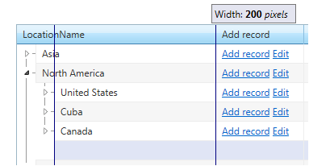

# Resizing

You can allow users to change the width of grid columns by dragging the handle between column headers. To turn on column resizing just set __ClientSettings.Resizing.AllowColumnResize__ property to __True.__ The default valueof this property is __False__.

When resizing is enabled (__AllowColumnResize__ is __True__), you can disable column resizing for individual columns by setting the column's __Resizable__ property to __False__. Setting a column's __Resizable__ property has no effect if __AllowColumnResize__ is__False__.

## Real-Time Resizing

There are two types of column resizing with respect to visualization:

* The content of the resized columns can be rendered real-time as the user drags the handle. This feature puts a significantload on client computer's CPU.

* Users can see only the handle moving during a resize operation, and only when the mouse is released are the resized columns rendered. In this mode, the load on the CPU is much lighter.

To specify whether columns are resized using real-time resizing, set the __ClientSettings.Resizing.EnableRealTimeResize__ property. The default value for this property is __False__.

When __EnableRealTimeResize__ is __False__, only the resizing handle is rendered:

When __EnableRealTimeResize__ is __True__, the column content is rendered during resize:

## Resize Mode

There are three modes of column resizing:

* __NoScroll__ (this is the default value) - No changes in the width of the TreeList. The resized column changes width – while the other columns are squeezed at the two ends.

* __AllowScroll__ - Works only when scrolling is turned on. Does not change the width of the treelist, only the width of its inner table and adds scroll. The resized column changes width while the other columns stay the same.

* __ResizeTreeList__ - The whole control changes width together with the resized column. Other columnsstay the same width.

>note When in __NoScroll__ resize mode in order to squeeze the columns to right properly (without breaking the TreeList layout)if they have a predefined width it is automatically cleared! Or in other words the widths for all columns on the right of the currently resized one will be cleared when resizing in NoScroll mode to avoid breaking the layout of the control.
>

## RadTreeList column properties

* __MinWidth__ - property which gets/sets the minimum width only for the currently resized column.If another column with minWidth is auto-squeezed in a result of resizing then its minWidth is not respected!

* __MaxWidth__ - property which gets/sets the maximum width only for the currently resized column. If another column with maxWidth is auto-extended in a result of resizing then its maxWidth is not re spected!

>note  __Resizing First Column__ – all width properties for the first column (Width, MinWidth, MaxWidth) are calculated by starting after the innermost expand-collapse cell until the beginning of the second column. The resizing is also based on this so you cannot resize further than this left boundary: (on the image bellow – resizing first column with width 200px: (the whole column is actually 246px wide because we have 2 levels expanded))
>

