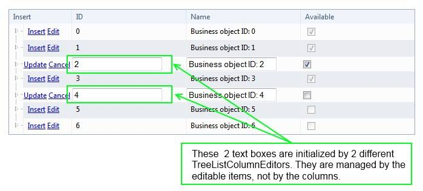

# Auto-Generated Editors

Editable columns inside a **RadTreeList** control supply a default editor that enables users to edit the values in the column.

>note Editable columns are columns that implement the **ITreeListEditableColumn** interface.
>

## Default Column Editors

The following table lists the default column editors for each of the built-in editable column types:

>caption  

| Column type | Default column editor | Column editor base class |
| ------ | ------ | ------ |
|TreeListBoundColumn|TreeListTextBoxColumnEditor|TreeListTextColumnEditor|
|TreeListCheckBoxColumn|TreeListCheckBoxListColumnEditor|TreeListBoolColumnEditor|
|TreeListDateTimeColumn|TreeListTimeColumnEditor|TreeListColumnEditor|
|TreeListNumericColumn|TreeListNumericColumnEditor|TreeListTextColumnEditor|
|TreeListTemplateColumn|TreeListTemplateColumnEditor|TreeListColumnEditorBase|

## 

The architecture of the columnRadTreeList editors completely detaches columns from editors. In RadTreeList, any editable column can be attached to any column editor. For example a TreeListBoundColumn can work with a TreeListNumericColumnEditor and a TreeListDateTimeColumn can use a TreeListTextBoxColumnEditor.

This is made available through clear separation of responsibilities between a treelist column and a column editor.The editable column in RadTreeList is NOT responsible for initializing a column editor, getting and setting an edited value or formatting the result of extraction. These are a responsibility of the column editor. Even though an editable column can intercept any data going between RadTreeList and its own designated column editor, it simply passes them along. The column editor, on its part, is responsible for receiving the raw data, formatting, type conversion, display, user input and extraction.

With RadTreeList, a column editor is a meeting point of an editable item and an editable column. Each editable item initializes and manages column editors for each editable column. A single column editor represents a single set of UI controls provided for data editing in a specified TreeListEditableItem for a given TreeListEditableColumn. A TreeListColumnEditor is not managed by the column. It is managed by and kept in a TreeListEditableItem. The editable column only provides an instance of the column editor.
