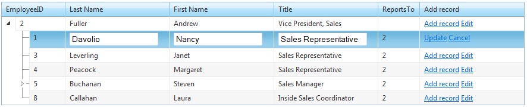

# Edit Mode Overview


RadTreeList supports the below edit modes:

* __InPlacehttp://www.telerik.com/help/aspnet-ajax/treelist-edit-modes.html#Section1_self__

* __EditFormshttp://www.telerik.com/help/aspnet-ajax/treelist-edit-modes.html#Section2_self__

* __PopUphttp://www.telerik.com/help/aspnet-ajax/treelist-edit-modes.html#Section3_self__

The default edit mode of RadTreeList is __EditForms__. To specify which edit mode will your control, you can set its __EditMode__ property to one of the above values.

## InPlace edit mode

To display the treelist in-place edit form, you need to set the __EditMode__ property of your RadTreeList control to __InPlace__. When an item goes in edit mode, the edit form will be displayed instead of the regular treelist item.

````ASPNET
	        <telerik:RadTreeList ID="RadTreeList1" runat="server" EditMode="InPlace" 
	            DataKeyNames="EmployeeID" ParentDataKeyNames="ReportsTo" DataSourceID="SqlDataSource1">            
	        </telerik:RadTreeList>
````



>note Note that in-place edit mode is supported only for auto-generated edit forms.
>


When __InPlace__ editing is applied, in the ItemCreated/ItemDataBound you can access the edit/insert form as below:

>tabbedCode

````C#
	    protected void RadTreeList1_ItemCreated(object sender, TreeListItemCreatedEventArgs e)
	    {
	        if (e.Item is TreeListDataItem)
	        {
	            //item is in regular mode
	        }
	        if (e.Item is TreeListEditableItem && (e.Item as TreeListEditableItem).IsInEditMode)
	        {
	            //item is in edit mode
	        }
	        if (e.Item is TreeListDataInsertItem)
	        {
	            //item is in insert mode
	        }
	    }
````
````VB.NET
	    Protected Sub RadTreeList1_ItemCreated(ByVal sender As Object, ByVal e As TreeListItemCreatedEventArgs)
	        If TypeOf e.Item Is TreeListDataItem Then
	            'item is in regular mode
	        End If
	        If TypeOf e.Item Is TreeListEditableItem AndAlso CType(e.Item, TreeListEditableItem).IsInEditMode Then
	            'item is in edit mode
	        End If
	        If TypeOf e.Item Is TreeListDataInsertItem Then
	            'item is in insert mode
	        End If
	    End Sub
````
>end

## EditForms edit mode

To display the treelist in-forms edit form, you need to set the __EditMode__ property of your RadTreeList control to __EditForms__. When an item goes in edit mode, the edit form will be displaed just below the edited item.

````ASPNET
	        <telerik:RadTreeList ID="RadTreeList2" runat="server" EditMode="EditForms" 
	            DataKeyNames="EmployeeID" ParentDataKeyNames="ReportsTo" DataSourceID="SqlDataSource1">            
	        </telerik:RadTreeList>
````


When the RadTreeList edit mode is EditForms, you can access the edited item and the edit/insert form on ItemCreated/ItemDataBound as below:

>tabbedCode

````C#
	    protected void RadTreeList2_ItemCreated(object sender, TreeListItemCreatedEventArgs e)
	    {
	        if (e.Item is TreeListDataItem)
	        {
	            //item is in regular mode
	        }
	        if (e.Item is TreeListEditFormItem)
	        {
	            //item is in edit mode
	        }
	        if (e.Item is TreeListEditFormInsertItem)
	        {
	            //item is in insert mode
	        }
	    }
````
````VB.NET
	    Protected Sub RadTreeList2_ItemCreated(ByVal sender As Object, ByVal e As TreeListItemCreatedEventArgs)
	        If TypeOf e.Item Is TreeListDataItem Then
	            'item is in regular mode
	        End If
	        If TypeOf e.Item Is TreeListEditFormItem Then
	            'item is in edit mode
	        End If
	        If TypeOf e.Item Is TreeListEditFormInsertItem Then
	            'item is in insert mode
	        End If
	    End Sub
````
>end

## PopUp edit mode

To display the treelist pop-up edit form, you need to set the __EditMode__ property of your RadTreeList control to __PopUp__. When an item goes into edit mode, the edit form will be displayed in front of the treelist and the edited item style will change respectively.

````ASPNET
	        <telerik:RadTreeList ID="RadTreeList3" runat="server" EditMode="PopUp" 
	            DataKeyNames="EmployeeID" ParentDataKeyNames="ReportsTo" DataSourceID="SqlDataSource1">            
	        </telerik:RadTreeList>
````


When the RadTreeList edit mode is PopUp, you can access the edited item and the edit/insert form on ItemCreated/ItemDataBound as below:

>tabbedCode

````C#
	    protected void RadTreeList3_ItemCreated(object sender, TreeListItemCreatedEventArgs e)
	    {
	        if (e.Item is TreeListDataItem)
	        {
	            //item is in regular mode
	        }
	        if (e.Item is TreeListEditFormItem)
	        {
	            //item is in edit mode
	        }
	        if (e.Item is TreeListEditFormInsertItem)
	        {
	            //item is in insert mode
	        }
	    }
````
````VB.NET
	    Protected Sub RadTreeList3_ItemCreated(ByVal sender As Object, ByVal e As TreeListItemCreatedEventArgs)
	        If TypeOf e.Item Is TreeListDataItem Then
	            'item is in regular mode
	        End If
	        If TypeOf e.Item Is TreeListEditFormItem Then
	            'item is in edit mode
	        End If
	        If TypeOf e.Item Is TreeListEditFormInsertItem Then
	            'item is in insert mode
	        End If
	    End Sub
````
>end

>note If you want to hide the the duplicate caption text that shows in the popup edit form, you can set the __EditFormSettings.PopUpSettings.ShowCaptionInEditForm__ property of the treelist control to __false__ .
>


# See Also

 * [EditForm Types]()

 * [NET 2.0 Automatic CRUD operations demo](http://demos.telerik.com/aspnet-ajax/treeList/examples/dataediting/net2automaticdataediting/defaultcs.aspx)

 * [NET 3.5 Automatic CRUD operations demo](http://demos.telerik.com/aspnet-ajax/treeList/examples/dataediting/net35automaticdataediting/defaultcs.aspx)

 * [Form Template/User Control edit form](http://demos.telerik.com/aspnet-ajax-beta/treeList/examples/dataediting/formtemplateusercontrol/defaultcs.aspx)
