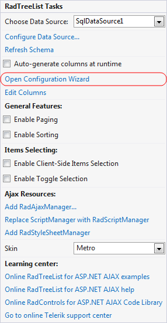
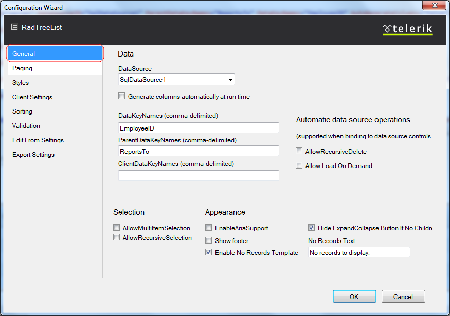
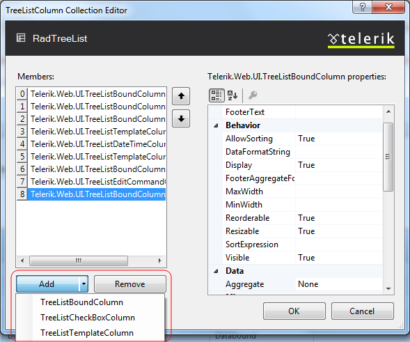

# Design Time

## Smart Tag

The **RadTreeList** Smart Tag provides convenient access to themost common settings of the control. You can display the Smart Tag by right clicking on theRadTreeList in the design window, and choosing the "Show Smart Tag" option from its context menu.

## Configure Data Source

You can easily configure declarative data source by choosing Configure Data Source linkfrom the Smart Tag of the RadTreeList control:

## Open Configuration Wizard

Open Configuration Wizard link displays RadTreeList wizard with General settingswhich lets you customize/configure the RadTreeList control.

The **General** section allows you to set data source for the treelist control. You need to set the DataKeyNames and ParentDataKeyNames properties. The ParentDataKeyNames property will be used for setting the proper relation.

The **Paging** section of the Telerik RadTreeList WizardForm lets you specify whether your treelist will use pages and the specific paging options.

The **Styles** sectionlets you fully customize the appearance of Telerik RadTreeList. Here you can set the colors for the treelist elements, the style for the strings and the element alignment

The **Client Settings** section allows you to enable client functionalities such as **selecting** and **scrolling** and also attach RadTreeList **client events**.

The **Sorting** section lets you select the type of sorting that **RadTreeList** will apply. In addition you can set the text of the tooltips that will appear when hovering over the header item.

The **Validation** section lets you specify whether to allow validation. You can also set validation groups and specific events that will trigger the validation.

The **Edit Form Settings** section allows you to select the edit form type. Also you can configure different caption settings or set a path to the user control file if you are using a WebUserControl.

The **Export Settings** section provides an easy way to configure **RadTreeList** for exporting.

## Edit Columns

The Edit Columns option allows you to set the way columns are generated and visualized.

**RadTreeListColumn Collection Editor** will let you display onlyspecific data fields from a given database. Moreover, you can define custom properties forthe columns that present these fields. You can use the Add button to create different columnsin the treelist. The columns will appear in the "Selected Columns" list. You can use the Upand Down buttons to re-order the columns and the Remove button to remove a column from thislist. From the "Members" list choose the columns which you want to bind (display).

## Ajax Resources

* Add RadAjaxManager...- adds a RadAjaxManager component to your Web page anddisplays the RadAjaxManager Property Builder where you can configure it.

* Replace ScriptManager with RadScriptManager - replaces the default ScriptManagercomponent that is added for AJAX-enabled Web sites with RadScriptManager.

* Add RadStyleSheetManager - adds a RadStyleSheetManager to your Web page.

## Learning Center

Links navigate you directly to RadTreeList examples, help, or code libraries. You canalso search the Telerik web site for a given string.
