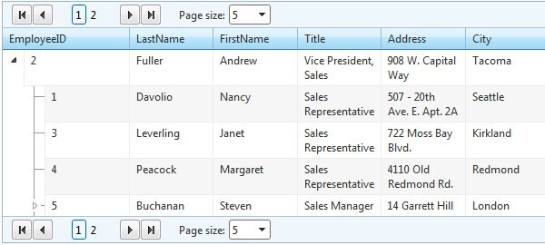

# Paging


**RadTreeList** supports paging functionality which allows the users to view thedata, separated in chunks. This is helpful in cases where the control is bound to a large collection ofdata which would be impractical or even impossible to display on a single page. Depending on thedevelopers' preferences, the appearance of the pager may vary from a simple page-number buttons to amore sophisticated slider control.

To enable this functionality in **RadTreeList**, you should set the **AllowPaging** property to true.

````ASPNET
<telerik:RadTreeList ID="RadTreeList1" runat="server" AllowPaging="true" />
````


**RadTreeList** exposes the **PageSizeControlType** property in its **PagerStyle** property collection which is an enum of type **PagerDropDownControlType**.It has three values available with **RadComboBox** being the default one:

* **None**

* **RadComboBox**

* **RadDropDownList**

As it name implies, the property specifies what type of page size drop down control will be rendered.The property provides an easy way to switch off the page size combo or replace it with its light weight counterpart **RadDropDownList**.

## Pager API

The following methods and properties are exposed in the **RadTreeList**'sserver-side Pager API:


| Property | Description |
| ------ | ------ |
| **PageSize** |Determines the maximum items displayed on a single page.|
| **PagerStyle-FirstPageToolTip** |The text that is displayed when hovering the FirstPage button|
| **PagerStyle-NextPageToolTip** |The text that is displayed when hovering the NextPage button|
| **PagerStyle-PrevPageToolTip** |The text that is displayed when hovering the PrevPage button|
| **PagerStyle-LastPageToolTip** |The text that is displayed when hovering the LastPage button|
| **PageButtonCount** |The number of numeric buttons in the pager|
| **Position** |Determines the position of the Pager in RadTreeList: **Top**, **Bottom**, **TopAndBottom**|
| **Mode** |This property sets the appearance of the Pager. The available modes are: **NextPrev**, **NumericPages**, **NextPrevAndNumeric**, **NextPrevNumericAndAdvanced**, **Advanced**, **Slider**|


