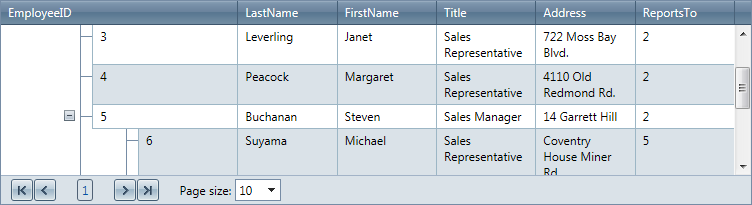
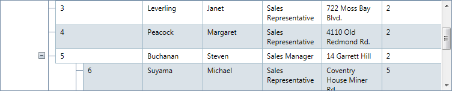

# Scrolling Overview


Often, when constructing a Web page that contains a treelist, there aredesign limitations regarding the size of the treelist. In such cases, youmay need to enable client-side treelist scrolling so that the treelist can fit it in the allowed space. You can enable scrolling by setting the__ClientSettings.Scrolling.AllowScroll__ property to __True__ (By default its value is False.)

>note When scrolling is enabled, the treelist columns should declare HeaderStyle.Width.
>


## Using static headers

The most common problem while scrolling is losing the context of the current column. This context is supplied by the column header. RadTreeList lets you keep the header at the top even when scrolling the treelist. To enable this feature, set the __ClientSettings.Scrolling.UseStaticHeaders__ property to True. (Its default value is False.)

When __UseStaticHeaders__ is __True__, the header row is still visible,even when the treelist is scrolled:

When __UseStaticHeaders__ is __False__, the header scrolls along with the data rows:

## Setting height to the scrollable RadTreeList

__ClientSettings.Scrolling.ScrollHeight__ property determines the height of the control's scrollable area when scrolling is enabled. Depending on whether static headers are enabled or not, the scrollable area includes different portions of the RadTreeList control:

* If static headers are enabled, the scrollable container includes only the data and footer items. The header and pager are "static" (not scrolled).

* If static headers are not enabled, the scrollable container includes everything.

## Saving scroll position

__ClientSettings.Scrolling.SaveScrollPosition__ property gets or sets a value indicating whether RadTreeList willkeep the scroll position during postbacks.

You can set the scrolling properties as below:

````ASPNET
	  <telerik:RadTreeList ID="RadTreeList1" runat="server">
	        <ClientSettings>
	            <Scrolling AllowScroll="true" UseStaticHeaders="true" SaveScrollPosition="true" ScrollHeight="350px" />
	        </ClientSettings>
	    </telerik:RadTreeList>
````


