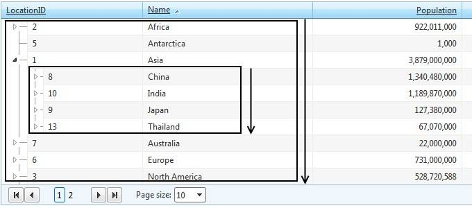

# Sorting

As expected from a sophisticated databound control, **RadTreeList** offerssorting capabilities that allows the users to conveniently order the items in the desired direction. Toenable this functionality you just have to set **AllowSorting** property to **true** and the control will handle the sorting operations automatically.

There are three sort modes:

* **Ascending** - orders the items in ascending order.

* **Descending** - orders the items in descending order.

* **None** - the items are ordered in the way they came from the datasource ("Natural" sort).

**RadTreeList** also supports sorting by multiple data fields - this is theso-called **Multi-column sorting**. To enable this mode, set the **AllowMultiColumnSorting** to **true**.

## Sorting in RadTreeList

Due to the self-referencing nature of the control, the sorting takes effect "per-level". Basically,this means that each level of the hierarchical structure is sorted independently. The screenshot belowillustrates this behavior:

## Sorting API

**RadTreeList** exposes the following properties and methods:

| Property | Description |
| ------ | ------ |
| **AllowMultiColumnSorting** |Determines whether the multi-column sorting functionality is enabled.|
| **AllowNaturalSort** |Enables or disables the "natural" sort mode where the items are ordered in the way they came fromthe datasource.|
| **AllowSorting** |Enables the sorting functionality in RadTreeList.|
| **SortExpressions** |SortExpressions collection. Contains the expressions that are applied to the control.|
