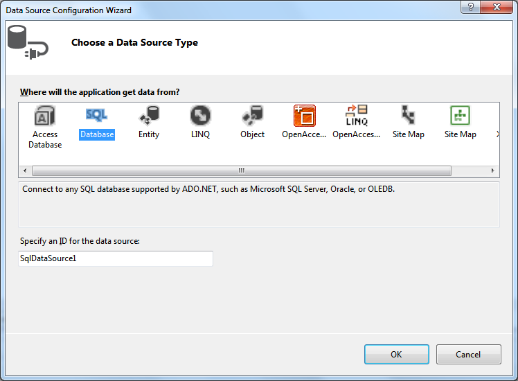

# Getting Started


This tutorial will walk you through creating a Web page that contains a RadTreeList control. It shows how to create and bind a RadTreeList control using a declarative data source.

## Creating and Binding the RadTreeList

1. Locate the "..\Live Demos\App_Data" folder underneath the folder where you have installed UI for ASP.NET AJAX controls. In this folder, find the "Northwind.mdf" file and copy it into the App_Data folder of your Web application. The Solution Explorer for your application may look something like the following:


2. Using the RadTreeList Smart tag expand the drop-down list labelled **Choose Data Source** and select ```<New data source...>``:


3. The **Data Source Configuration Wizard** appears. On the **Choose a Data Source Type** page, select "SQL Database" and click OK:


4. On the **Choose Your Data Connection** page click the New Connection button and select the "Northwind.mdb" file that you copied into App_Data folder. Then click the Next button:


5. On the **Configure Select Statement** page, select the "Employees" table from the drop-down list, and select the "EmployeeID", "LastName", "FirstName", "Region", "PostalCode" and "Country" fields. Then choose Next:


6. On the **Test Query** page, click the Test Query button to see the data. Then click Finish, to exit the Configure Data Source wizard:


For more information about how to configure the RadTreeList through the Visual Studio designer, see the [Design Time]() article.
