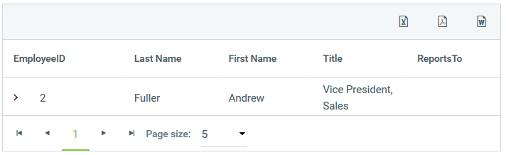

# Command Item


Since R2 2016 the **RadTreeList** control provides **CommandItem**. The CommandItem is a placeholder for commands that can perform some action on the selected/all items.See the [Command reference](http://docs.telerik.com/devtools/aspnet-ajax/controls/treelist/control-lifecycle/command-reference.html ) topic for details about the available commands.



To enable the command item you must set **CommandItemDisplay="DesiredPosition"** that accepts the following values: Top, Bottom, TopAndBottom, and None (default).
There is a declarative **CommandItemStyle** added to the TreeList control. It can be used for simple decoration purposes.

The [ExportToPdf], [ExportToWord] and [ExportToExcel] buttons will be automatically placed in a command item (**TreeListCommandItem**). If you need to access them server-side you have to know their IDs:

* **ExportToPdf -** ExportToPdf html button

* **ExportToWord -** ExportToWord html button

* **ExportToExcel -** ExportToExcel html button

All tooltips can be configured through the associated **CommandItemSettings**. Also you can toggle the visibility of the export buttons through the **CommandItemSettings**

````ASP.NET
<telerik:RadTreeList RenderMode="Lightweight" runat="server" Width="700px" Skin="Material" ID="RadTreeList1" CommandItemDisplay="Top" DataSourceID="SqlDataSource1" AutoGenerateColumns="false" AllowPaging="true" PageSize="5" DataKeyNames="EmployeeID" ParentDataKeyNames="ReportsTo">
               <CommandItemSettings ExportToExcelText="Export Button1" ShowExportToPdfButton="false" />
               <CommandItemStyle BackColor="#FFC0C0" BorderColor="#FFE0C0" BorderStyle="Dotted"
                   BorderWidth="1px" Font-Bold="True" Font-Italic="True" Font-Names="Arial Black"
                   Font-Overline="True" Font-Size="Small" Font-Strikeout="True" Font-Underline="True"
                   ForeColor="#404040" Height="40px" HorizontalAlign="Left" VerticalAlign="Middle"
                   Width="800px" Wrap="True" />
               <Columns>
                   <telerik:TreeListBoundColumn DataField="EmployeeID" HeaderText="EmployeeID" UniqueName="EmployeeID">
                   </telerik:TreeListBoundColumn>
                   <telerik:TreeListBoundColumn DataField="LastName" HeaderText="Last Name" UniqueName="LastName">
                   </telerik:TreeListBoundColumn>
                   <telerik:TreeListBoundColumn DataField="FirstName" HeaderText="First Name" UniqueName="FirstName">
                   </telerik:TreeListBoundColumn>
                   <telerik:TreeListBoundColumn DataField="Title" HeaderText="Title" UniqueName="Title">
                   </telerik:TreeListBoundColumn>
                   <telerik:TreeListBoundColumn DataField="ReportsTo" HeaderText="ReportsTo" UniqueName="ReportsTo">
                   </telerik:TreeListBoundColumn>
               </Columns>
           </telerik:RadTreeList>
           <asp:SqlDataSource ID="SqlDataSource1" ConnectionString="<%$ ConnectionStrings:NorthwindConnectionString %>" ProviderName="System.Data.SqlClient" SelectCommand="SELECT EmployeeID, LastName, FirstName, Title, ReportsTo FROM Employees" runat="server"></asp:SqlDataSource>			
````
# Command Item in Mobile Render Mode

The command item rendering in mobile mode is different and it is not located in the table rows
Because of the reason above, CommandItemStyle won't have any effect on the rendering and the CommandItem (row) will not be added to the table rows.
The default value is TreeListCommandItemDisplay is set to Top if either AllowColumnHide or AllowColumnReorder are enabled. Otherwise the default value is TreeListCommandItemDisplay is None

The animation below demonstrates the CommandItem functionality in Mobile RenderMode:


