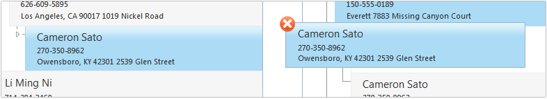

# Items Drag and Drop


The rich drag and drop API facilitate the developers when implementing copy/moveoperations between different RadTreeList and other controls. Among the standard server and	client methods and properties you will also find some useful options like:

* automatic items reorder when using SqlDataSource control.

* option to display a special icon (drop clue) that can be changed (manually)	depending on the hovered container

## Configuring RadTreeList for Drag and Drop

To enable this functionality in RadTreeList, you need to:

* set ClientSettings-AllowItemsDragDrop property to true

* enable client selection by setting the	ClientSettings-Selecting-AllowItemSelection property to true


````ASPNET
<ClientSettings AllowItemsDragDrop="true">
	<Selecting AllowItemSelection="True" />
````


## Item Reordering

RadTreeList supports automatic item reordering when SqlDataSource is used. In this case,the developer needs to configure the datasource control to have valid update command (as for automatic operations). When binding to another type of datasource, the reordering should be handled manually via the client/server API.

## Server-Side API


>caption  

| Name | Type | Description |
| ------ | ------ | ------ |
| **OnItemDrop** |event|Occurs when a RadTreeList item is dragged and dropped over HTML element (if not cancelled via the client-side API)|
| **AllowItemsDragDrop** |property|Occurs when a RadTreeList item is dragged and dropped over HTML element(if not cancelled via the client-side API)|

## Client-Side API

Below you can find a list of all client-side events that can be used whenimplementing drag and drop operations. It is important to mention, that OnItemDraggingand OnItemDropping events can be cancelled by setting the set_cancel property available	in their event arguments.

A convenient feature of the client-side API is that the control automatically detect	some of the invalid reordering operations such as trying to drag a parent item onto itschild or trying to drop an item over itself. In these cases, the get_canDrop propertywill return false when invoked in the OnItemDragging event.


>caption  

| Name | Type | Description |
| ------ | ------ | ------ |
| **OnItemDragStarted** |event| fired when a drag action is started.|
| **OnItemDragging** |event| fired when a TreeListDataItem is being dragged.|
| **OnItemDropping** |event| fired when a TreeListDataItem is being dropped.|
| **OnItemDropped** |event| fired when a TreeListDataItem has been dropped.|

# See Also

 * [TreeList Object]()

 * [Items drag and drop demo](http://demos.telerik.com/aspnet-ajax/treelist/examples/itemsdragdrop/defaultcs.aspx)
