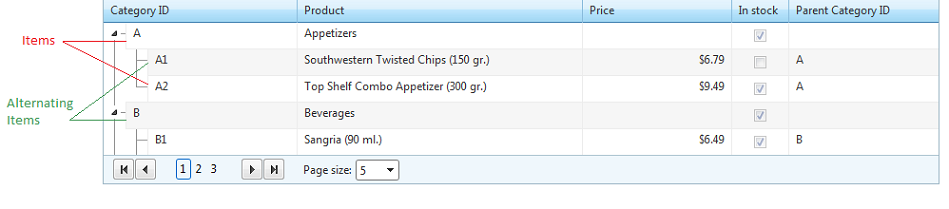
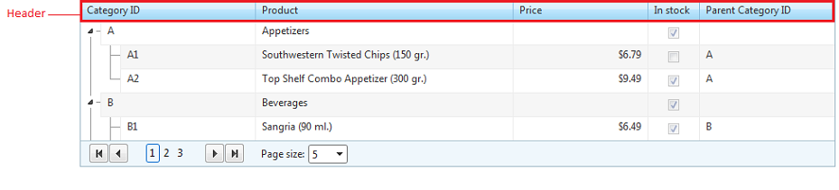

# Items Overview

This topic will give you a general idea of the various items in the RadTreeList control.

## TreeList item types:

* **TreeListDataItem**

* **TreeListHeaderItem**

* **TreeListPagerItem**

* **TreeListDetailTemplateItem**

Below, you will find descriptions of these item types.

## TreeListDataItem

The rows of the treelist control are called data items and are of type **TreeListDataItem**. They can be accessed using the **Items** collection of the control.

If the treelist uses different styling for odd- and even- numbered rows, the even-numbered are called **AlternitingItems** while the odd ones are just **Items**. The **TreeListDataItem.ItemType** property returns whether the current TreeListDataItem is Item or AlternatingItem. Its style can be customized by using respectively the **ItemStyle** and **AlternatingItemStyle** properties.

For more information on the TreeListDataItem object, see its [Server-side API]() and [Client-side API]() documentation articles.

## TreeListHeaderItem

The header appears over the data items and is of type **TreeListHeaderItem**. It displays the column names if specified in the **HeaderText** property and facilitates some functions of the control like sorting. Its look can be customized using the HeaderStyle property.

## TreeListPagerItem

If **AllowPaging** is set to **true**, the RadTreeList control renders a pager item (**TreeListPagerItem**) which can be positioned on the top and/or bottom of the control. It is always visible, no matter if the number of expanded items is larger than the page size. Each time a row is expanded/collapsed, the pager refreshes based on the number of expanded items.

You can choose what controls to appear in the pager item by setting the **PagerStyle.Mode** property. If none of the predefined configurations satisfies your requirements, you can specify your own **PagerTemplate**.

You can read more about the TreeListPagerItem API in the [Basic Paging]() article.

## TreeListDetailTemplateItem

RadTreeList allows you to specify a **DetailTemplate** that will be rendered as a **TreeListDetailTemplateItem** under each data item, thus allowing you to design an extra row for displaying its data. Note that the detail items are **not** counted as separate data items when the page count is calculated.

For more information about the DetailTemplate of RadTreeList, you can read the respective [ help topic]() and view the [ Detail Template online demo. ](https://demos.telerik.com/aspnet-ajax/treelist/examples/appearance/detailitemtemplate/defaultcs.aspx)

## TreeListNoRecordsItem

RadTreeList allows you to specify a **NoRecordsTemplate** that will be rendered when the treelist control is bound to an empty datasource, allowing you to show a more customized message to the user.
