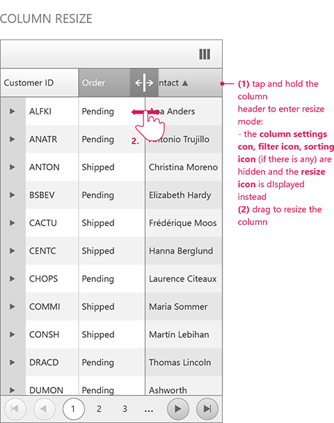
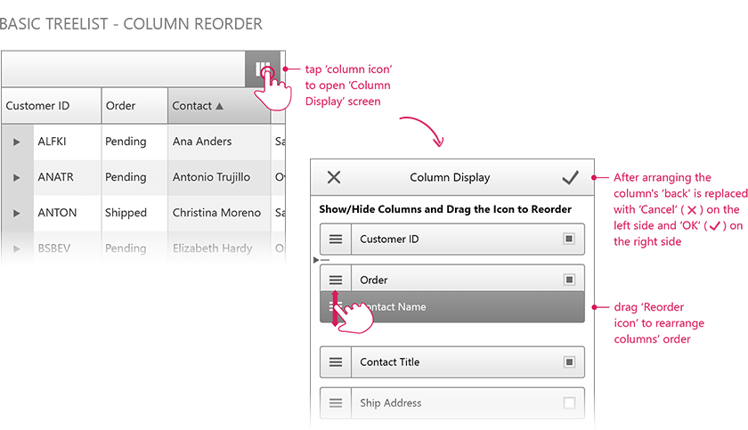
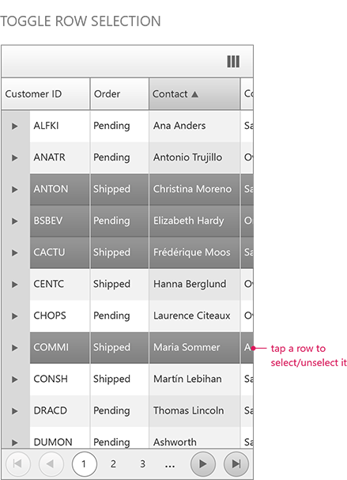

#Selecting, Resizing and Reordering

In this help article you will find helpful information on how to resize and reorder columns and also selecting items when the **RenderMode** is set to **Mobile**.

## Resizing

The functionality works in a similar manner as when viewing the page on a desktop machine. The only difference is that the user should tap, instead of clicking on the column separator in order to enter in resize mode.

## Reordering

The functionality works in a similar manner as when viewing the page on a desktop machine. The only difference is that the user should tap, instead of clicking on the column header in order to reorder the columns.

## Selecting
The selection functionality of the **Mobile TreeList** control has the following characteristics:

