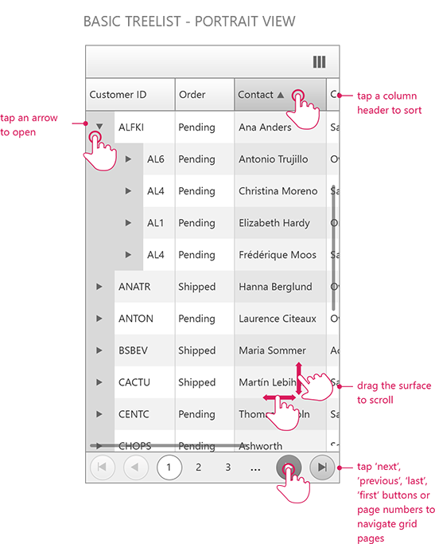





# Mobile Support Overview

Since Q2 2015 **RadTreeList** control provides separate mobile render mode that can be set through the **RenderMode** property.

## 

On mobile devices the **scrolling** and row **drag-drop** features in the treelist control are performed by the same touch gesture: dragging of the content area of the treelist with one tough point. This imposes a limitation when both features are enabled on touch devices because it cannot be exclusively determined which one of the two should be performed. One way to distinguish between scrolling and row drag-drop on mobile devices is to use a **TreeListDragDropColumn** - this way the dragging of the rows will be performed only when you drag a row by the icon in the TreeListDragDropColumn and on the rest of the content area scrolling will be performed.

The image below demonstrates the grid control **scrolling**, **expanding**, **paging** and **sorting** gestures.

