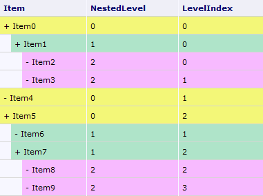
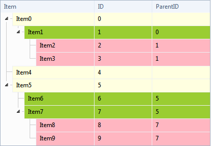

# Structure


## 

**RadTreeList** is used to display self-hierarchical data in a grid style. When configuring it, you need to set the **DataKeyNames** and the **ParentDataKeyNames** properties. It is important to know that the fields used for the data key names should be of the same type. Thus if you have DataKeyName of type string, its corresponding ParentDataKeyName should be string as well.

After you have set the above mentioned properties and bound the RadTreeList to your data source, the RadTreeList can easily determine which are the root items and which are their child items. There are two rules followed when determining the root items:

1. If the key fields are of value type or string, the root items are either:

	* items with ParentKeyValue set to the default value of the type

	* items for which the parent key value is equal to the key value

	Items with parent key value which does not fulfil the above requirement, and have no parent item (e.g. their parent key value does not correspond to any other item key value) are not included in the resolved data source of the treelist at all.

1. If the key fields are complex objects, a recursive check on their properties is performed until the above rule is met.

Another important thing to know is what is the HierarchialIndex of each TreeListDataItem and how it is formed. This index is object of type **TreeListHierarchyIndex** which has two properties: **NestedLevel** and **LevelIndex**. The NestedLevel indicates in which level of the treelist hierarcy is the item in question, while LevelIndex returns the index of the item in this level.

The below table illustrates a sample structure with the corresponding indexes. Next to it, you can see a screenshot of a RadTreeList controlhaving this structure. In it you can observe how the key values and parent key values are reflected in the rendered table. The code used to build this treelist is shown below the images.


>caption  

|  |  |
| ------ | ------ |


````ASPNET
	    <telerik:RadTreeList ID="RadTreeList1" runat="server" DataKeyNames="ID" ParentDataKeyNames="ParentID"
	        Width="410px" Skin="Windows7" GridLines="Both" AutoGenerateColumns="true" OnNeedDataSource="RadTreeList1_NeedDataSource"
	        OnItemDataBound="RadTreeList1_ItemDataBound">
	    </telerik:RadTreeList>
````
````C#
	    protected void RadTreeList1_NeedDataSource(object sender, EventArgs e)
	    {
	        ArrayList employees = new ArrayList();
	        employees.Add(new TestItem("Item0", 0, null));
	        employees.Add(new TestItem("Item1", 1, 0));
	        employees.Add(new TestItem("Item2", 2, 1));
	        employees.Add(new TestItem("Item3", 3, 1));
	        employees.Add(new TestItem("Item4", 4, null));
	        employees.Add(new TestItem("Item5", 5, null));
	        employees.Add(new TestItem("Item6", 6, 5));
	        employees.Add(new TestItem("Item7", 7, 5));
	        employees.Add(new TestItem("Item8", 8, 7));
	        employees.Add(new TestItem("Item9", 9, 7));
	        RadTreeList1.DataSource = employees;
	    }
	
	    protected void RadTreeList1_ItemDataBound(object sender, TreeListItemDataBoundEventArgs e)
	    {
	        if (e.Item is TreeListDataItem)
	        {
	            TreeListDataItem item = e.Item as TreeListDataItem;
	            switch (item.HierarchyIndex.NestedLevel)
	            {
	                case 0:
	                    item.BackColor = System.Drawing.Color.LightYellow;
	                    break;
	                case 1:
	                    item.BackColor = System.Drawing.Color.YellowGreen;
	                    break;
	                case 2:
	                    item.BackColor = System.Drawing.Color.LightPink;
	                    break;
	            }
	        }
	    }
	
	    protected void Page_Load(object sender, EventArgs e)
	    {
	        if (!IsPostBack)
	        {
	            RadTreeList1.ExpandAllItems();
	        }
	    }
	
	    protected class TestItem
	    {
	        string _item;
	        int _id;
	        int? _parentId;
	
	        public TestItem(string item, int id, int? parentId)
	        {
	            _item = item;
	            _id = id;
	            _parentId = parentId;
	        }
	
	        public string Item
	        {
	            get
	            {
	                return this._item;
	            }
	            set
	            {
	                this._item = value;
	            }
	        }
	        public int ID
	        {
	            get
	            {
	                return this._id;
	            }
	        }
	        public int? ParentID
	        {
	            get
	            {
	                return this._parentId;
	            }
	        }
	    }
````
````VB
	    Protected Sub RadTreeList1_NeedDataSource(ByVal sender As Object, ByVal e As EventArgs)
	        Dim employees As New ArrayList()
	        employees.Add(New TestItem("Item0", 0, Nothing))
	        employees.Add(New TestItem("Item1", 1, 0))
	        employees.Add(New TestItem("Item2", 2, 1))
	        employees.Add(New TestItem("Item3", 3, 1))
	        employees.Add(New TestItem("Item4", 4, Nothing))
	        employees.Add(New TestItem("Item5", 5, Nothing))
	        employees.Add(New TestItem("Item6", 6, 5))
	        employees.Add(New TestItem("Item7", 7, 5))
	        employees.Add(New TestItem("Item8", 8, 7))
	        employees.Add(New TestItem("Item9", 9, 7))
	        RadTreeList1.DataSource = employees
	    End Sub
	
	    Protected Sub RadTreeList1_ItemDataBound(ByVal sender As Object, ByVal e As TreeListItemDataBoundEventArgs)
	        If TypeOf e.Item Is TreeListDataItem Then
	            Dim item As TreeListDataItem = TryCast(e.Item, TreeListDataItem)
	            Select Case item.HierarchyIndex.NestedLevel
	                Case 0
	                    item.BackColor = System.Drawing.Color.LightYellow
	                    Exit Select
	                Case 1
	                    item.BackColor = System.Drawing.Color.YellowGreen
	                    Exit Select
	                Case 2
	                    item.BackColor = System.Drawing.Color.LightPink
	                    Exit Select
	            End Select
	        End If
	    End Sub
	
	    Protected Sub Page_Load(ByVal sender As Object, ByVal e As EventArgs) Handles Me.Load
	        If Not IsPostBack Then
	            RadTreeList1.ExpandAllItems()
	        End If
	    End Sub
	
	    Protected Class TestItem
	        Private _item As String
	        Private _id As Integer
	        Private _parentId As System.Nullable(Of Integer)
	
	        Public Sub New(ByVal item As String, ByVal id As Integer, ByVal parentId As System.Nullable(Of Integer))
	            _item = item
	            _id = id
	            _parentId = parentId
	        End Sub
	
	        Public Property Item() As String
	            Get
	                Return Me._item
	            End Get
	            Set(ByVal value As String)
	                Me._item = value
	            End Set
	        End Property
	        Public ReadOnly Property ID() As Integer
	            Get
	                Return Me._id
	            End Get
	        End Property
	        Public ReadOnly Property ParentID() As System.Nullable(Of Integer)
	            Get
	                Return Me._parentId
	            End Get
	        End Property
	    End Class
````

