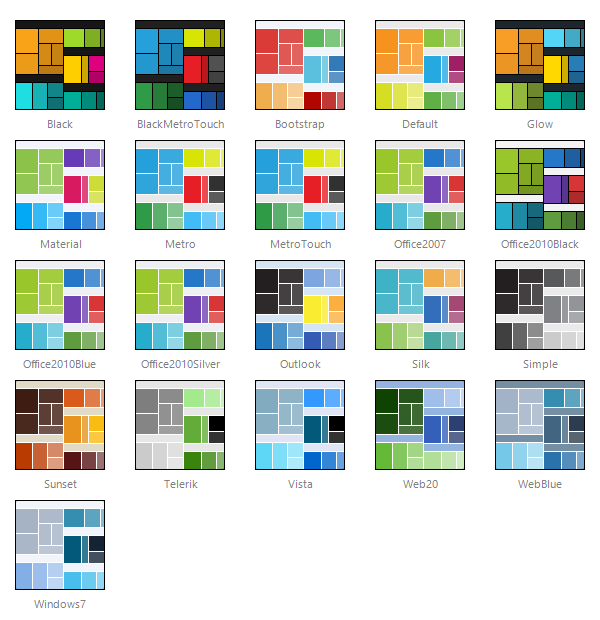

# Skins

## 

**RadTreeMap** uses **skins** to control its overall look-and-feel. A skin is a set of images and a CSS stylesheet that can be applied to the control elements (items, images, etc.) and defines their look and feel. To apply a skin to **RadTreeMap** set its **Skin** property, either using the properties pane or the control's Smart Tag.

**RadTreeMap** is installed with a number of preset skins:

