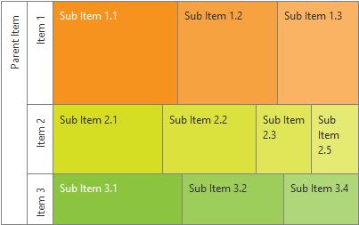
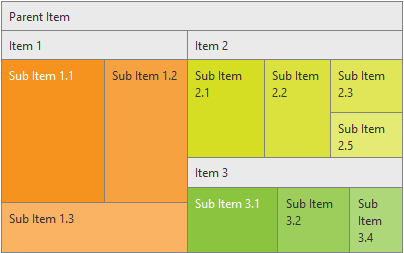
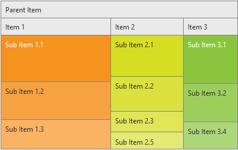

# Algorithm Types

The following article demonstrates the usage and the benefits of the **AlgorithmType** property of the **RadTreeMap**

## 

The **AlgorithmType** property of the **RadTreeMap** is used to specify how the underlying data of the control should be visualized. The property accepts one of the following three values:

* **Horizontal** - the **TreeMapItems** are displayed side by side, having the same height as their parent Item. (see Figure 1)

* **Squarified** - the area bellow the parent **TreeMapItem** is subdivided into square rectangles, which size represents their ratio.(see Figure 2)

* **Vertical** -the **TreeMapItems** are displayed one below the other, having the same width as their parent Item.(see Figure 3)

**Figure 1**: Demonstrates how the **RadTreeMap** is visualized, when **AlgorithmType** is set to Horizontal.

**Figure 2**: Demonstrates how the **RadTreeMap** is visualized, when **AlgorithmType** is set to Squarified.

**Figure 3**: Demonstrates how the **RadTreeMap** is visualized, when **AlgorithmType** is set to Vertical.
