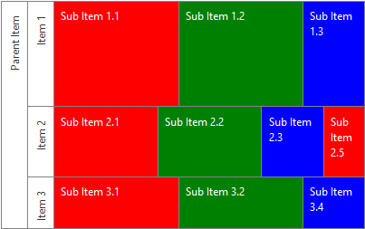

# Colors


The following article demonstrates the usage of the __Colors__ property of the __RadTreeMap__.

## 

The __Colors__ property of the __RadTreeMap__ is a collection of type __System.Drawing.Color__, which provides the ability to set custom colors. The list of colors will be applied on each group of TreeMapItems. If the amount of predefined colors, exceeds the number of items, the coloration stars from the first color all over again.

In the example bellow, you could examine how several colors are assigned to the __Colors__ collection of the RadTreeMap and in the __Figure 1__, you could observe how the control is visualized:


````ASPNET
	           <telerik:RadTreeMap runat="server" ID="TreeMap1"  Height="250" Width="400" AlgorithmType="Horizontal">
	                <Items>
	                    <telerik:TreeMapItem Text="Parent Item">
	                        <Items>
	                            <telerik:TreeMapItem Text="Item 1" Value="6">
	                                <Items>
	                                    <telerik:TreeMapItem Text="Sub Item 1.1" Value="2"></telerik:TreeMapItem>
	                                    <telerik:TreeMapItem Text="Sub Item 1.2" Value="2"></telerik:TreeMapItem>
	                                    <telerik:TreeMapItem Text="Sub Item 1.3" Value="1"></telerik:TreeMapItem>
	                                </Items>
	                            </telerik:TreeMapItem>
	                            <telerik:TreeMapItem Text="Item 2" Value="4">
	                                <Items>
	                                    <telerik:TreeMapItem Text="Sub Item 2.1" Value="5"></telerik:TreeMapItem>
	                                    <telerik:TreeMapItem Text="Sub Item 2.2" Value="5"></telerik:TreeMapItem>
	                                    <telerik:TreeMapItem Text="Sub Item 2.3" Value="3"></telerik:TreeMapItem>
	                                    <telerik:TreeMapItem Text="Sub Item 2.5" Value="2"></telerik:TreeMapItem>
	                                </Items>
	                            </telerik:TreeMapItem>
	                            <telerik:TreeMapItem Text="Item 3" Value="3">
	                                <Items>
	                                    <telerik:TreeMapItem Text="Sub Item 3.1" Value="2"></telerik:TreeMapItem>
	                                    <telerik:TreeMapItem Text="Sub Item 3.2" Value="2"></telerik:TreeMapItem>
	                                    <telerik:TreeMapItem Text="Sub Item 3.4" Value="1"></telerik:TreeMapItem>
	                                </Items>
	                            </telerik:TreeMapItem>
	                        </Items>
	                    </telerik:TreeMapItem>
	                </Items>
	            </telerik:RadTreeMap>
````
````C#
	    protected void Page_Load(object sender, EventArgs e)
	    {
	        TreeMap1.Colors.Add(Color.Red); 
	        TreeMap1.Colors.Add(Color.Green);
	        TreeMap1.Colors.Add(Color.Blue);
	
	        // Another way to populate the Colors collection
	        //TreeMap1.Colors.Add(ColorTranslator.FromHtml("Red"));
	        //TreeMap1.Colors.Add(ColorTranslator.FromHtml("Green"));
	        //TreeMap1.Colors.Add(ColorTranslator.FromHtml("Blue"));
	    }
````
````VB
	    Protected Sub Page_Load(sender As Object, e As EventArgs) Handles Me.Load
	
	        TreeMap1.Colors.Add(Color.Red)
	        TreeMap1.Colors.Add(Color.Green)
	        TreeMap1.Colors.Add(Color.Blue)
	
	        ' Another way to populate the Colors collection
	        'TreeMap1.Colors.Add(ColorTranslator.FromHtml("Red"))
	        'TreeMap1.Colors.Add(ColorTranslator.FromHtml("Green"))
	        'TreeMap1.Colors.Add(ColorTranslator.FromHtml("Blue"))
	    End Sub
````


__Figure 1__: Demonstrates how the __RadTreeMap__ is visualized, when custom colors are set.

__Note__ : The sub-items count of __Item 2__ exceeds the amount of predefined colors. Therefore, __Sub Item 2.5__ has the same color as __Sub Item 2.1__.
