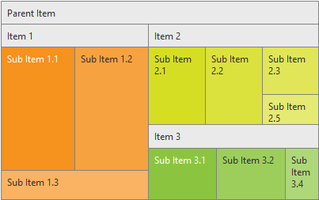

# Getting Started


The following article demonstrates how you can add a __RadTreeMap__ control with three steps. The end result will be similar to __Figure 1__:
>caption Figure 1: RadTreeMap data visualization with three easy steps.



>note The control visualizes its data in __Squarified AlgorithmType__ as this is the default algorithm type.
>


## 

To add a __RadTreeMap__ control into the page, you can simply drag it from the Visual Studio Toolbox into an ASP.NET page with correctly set ScriptManager control. Or you can paste the markup from__Example 1__ into the form element.

1. Add a __ScriptManager__ control on the Web Form.

1. Add a __RadTreeMap__ control on Web Form, with a preferable __Width__ and __Height__:

1. Add __RadTreeMapItems__ into the declaration of __RadTreeMap__ and set preferable __Text__ and __Value__. Note that the __Value__ of the items is used for calculation of their ratio, regarding the visualization.

__Example 1__: Simple declaration of a __RadTreeMap__ control.

>tabbedCode

````ASPNET
	        <telerik:radtreemap runat="server" id="RadTreeMap1" height="250" width="400">
	                <Items>
	                    <telerik:TreeMapItem Text="Parent Item">
	                        <Items>
	                            <telerik:TreeMapItem Text="Item 1" Value="6">
	                                <Items>
	                                    <telerik:TreeMapItem Text="Sub Item 1.1" Value="2"></telerik:TreeMapItem>
	                                    <telerik:TreeMapItem Text="Sub Item 1.2" Value="2"></telerik:TreeMapItem>
	                                    <telerik:TreeMapItem Text="Sub Item 1.3" Value="1"></telerik:TreeMapItem>
	                                </Items>
	                            </telerik:TreeMapItem>
	                            <telerik:TreeMapItem Text="Item 2" Value="4">
	                                <Items>
	                                    <telerik:TreeMapItem Text="Sub Item 2.1" Value="5"></telerik:TreeMapItem>
	                                    <telerik:TreeMapItem Text="Sub Item 2.2" Value="5"></telerik:TreeMapItem>
	                                    <telerik:TreeMapItem Text="Sub Item 2.3" Value="3"></telerik:TreeMapItem>
	                                    <telerik:TreeMapItem Text="Sub Item 2.5" Value="2"></telerik:TreeMapItem>
	                                </Items>
	                            </telerik:TreeMapItem>
	                            <telerik:TreeMapItem Text="Item 3" Value="3">
	                                <Items>
	                                    <telerik:TreeMapItem Text="Sub Item 3.1" Value="2"></telerik:TreeMapItem>
	                                    <telerik:TreeMapItem Text="Sub Item 3.2" Value="2"></telerik:TreeMapItem>
	                                    <telerik:TreeMapItem Text="Sub Item 3.4" Value="1"></telerik:TreeMapItem>
	                                </Items>
	                            </telerik:TreeMapItem>
	                        </Items>
	                    </telerik:TreeMapItem>
	                </Items>
	            </telerik:radtreemap>
````


>end

>note All __RadTreeMapItems__ should have one __Parent__ item.
>

