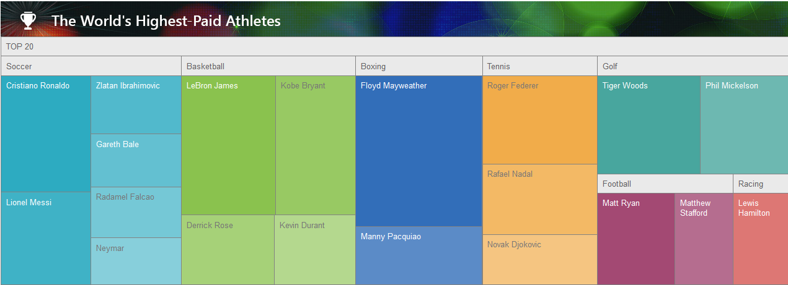

# TreeMap Overview

The __RadTreeMap__ for ASP.NET AJAX control suits perfectly for visualization of hierarchical data in a traditional tree structure. The control provides three options for displaying the data, which could be managed by the __AlgorithmType__ property - __Squarified, Horizontaland Vertical__ (see [AlgorithmType article]()). The most popular and widely used of them is the __Squarified__ type, which recursively subdivides area into approximately-square rectangles. As a result, the end user is provided with the structured data, represented by a numerous items, visualized on screen simultaneously with an efficient use of space. (see Figure 1)

## 

Another useful property of the __RadTreeMap__ is the __Colors__ property. The property represents a collection of type __System.Drawing.Color__, which could be used to add custom colors and thus specifying the list of colors, applied to each group of items.(see [Colors article]())

__Figure 1__: Demonstrates how the __RadTreeMap__ control visualizes its data in an efficient use of space, when the __AlgorithmType__ property is set to __Squarified__.

>important Using the __RadTreeMap__ in Internet Explorer 7 is not fully supported, as some glitches in the appearance may arise.
>

