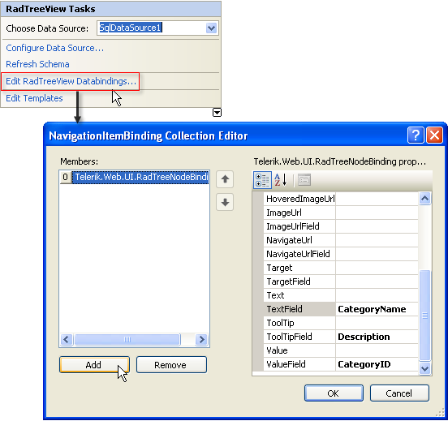

# Data Bindings


## 

The **DataTextField**, **DataValueField**, and **DataNavigateUrlField** properties let you map the fields of data items to the **Text**, **Value**, and **NavigateUrl** properties of the TreeView Nodes to which they are bound. By default, any other TreeView Node properties must be mapped using the [NodeDataBound]() event handler. However, as an alternate approach, you can use the **DataBindings** collection to declaratively supply the mapping for any or all ofthe following **RadTreeNode** properties:

* Text

* Value

* NavigateUrl

* Target

* ToolTip

* Enabled

* ImageUrl

* HoveredImageUrl

* ContexttreeviewID

In addition, the **DataBindings**

* To add a set of declarative Data Bindings to a TreeView, use the [NavigationItemBinding Collection Editor](). The Data Bindings are represented by a collection of **RadTreeNodeBinding** objects. Each item in the collection represents a set of Data Bindings between the Data Source and the Nodes in the TreeView for a given level of the TreeView (root Nodes, Nodes at the first child level, and so on). You can also create an item that gives the default mapping to cover any levels not specifically mapped by another item. The properties of each item in the collection specify how the **RadTreeNode** properties should be assigned:

	* For each mapped **RadTreeNode** property, there are two properties for the Data Binding: one, with the same name as the corresponding **RadTreeNode** property, is a hard-coded value that is assigned to all TreeView Nodes to which the Data Binding applies; the other, with the name of the property followed by the suffix "Field", is the name of a field from the Data Source where the Node gets its property value. Thus, for example, if your database contains a column named Text and you set **TextField**="Text", the **Text** property of all TreeView Nodes takes its value from the Text column in the database. Alternatively, if you set **Text**="Text", all your TreeView Nodes will take the static string "Text" as the value of their **Text** property.

	* The **Depth** property indicates the level of TreeView Nodes to which the Data Binding applies. If **Depth** is not set, the Data Binding applies to all TreeView Nodes not mapped by another binding. The **DataBindings**collection should contain only one item with no value assigned to the **Depth** property.

	* The **FormatString** property specifies how to format the text supplied by the **TextField** of the Data Source.

	* The **DataMember** property specifies the table from which to map Nodes. This property lets you use different tables from the same **DataSet** to supply values at different levels of the TreeView.

>note If multiple **RadTreeNodeBinding** objects are defined that conflict with each other, RadTreeView applies the Tree Node Bindings in the following order of precedence:
>
1.The **RadTreeNodeBinding** object that defines both a depth and a data member.
1.The **RadTreeNodeBinding** object that defines only the depth.
1.The **RadTreeNodeBinding** object that defines only the data member.
1.The **RadTreeNodeBinding** object that defines neither the depth nor the data member.>
**ASPX TreeView DataBindings Structure**In the ASPX page, the **DataBindings** collection resides within the **<RadTreeView>** tag. For example:

````ASPNET
<telerik:RadTreeView ID="RadTreeView1" runat="server" DataSourceID="SqlDataSource1">
    <DataBindings>
        <telerik:RadTreeNodeBinding TextField="CategoryName" ToolTipField="Description" ValueField="CategoryID" />
    </DataBindings>
</telerik:RadTreeView>
<asp:SqlDataSource ID="SqlDataSource1" runat="server" ConnectionString="<%$ ConnectionStrings:NorthwindConnectionString %>"
    SelectCommand="SELECT [CategoryID], [CategoryName], [Description] FROM [Categories]">
</asp:SqlDataSource>
````

**How to Enable DataBindings**

1. Set the **RadTreeView** **DataSourceID** property to an instance of a Data Source.

1. From the Telerik **RadTreeView** Smart Tag, select **Edit RadTreeView DataBindings**. The **NavigationItemBinding Collection Editor** dialog appears. 


1. Under **Members**, click **Add** to add one or more members. Two or more members are required if you want to bind different properties at different depth levels. (See **Depth** above.)

1. Set the properties for each member. Click **OK**to accept your changes and close the **NavigationItemBinding Collection Editor**.For a live example see [DataBindings demo](http://demos.telerik.com/aspnet-ajax/TreeView/Examples/Programming/DataBindings/DefaultCS.aspx).

# See Also

 * [NavigationItemBinding Collection Editor]()
