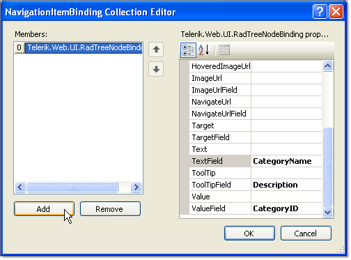

# NavigationItemBinding Collection Editor

## 

The **NavigationItemBinding Collection Builder** lets specify how to map the fields from a declarative data source to the properties of the items in your treeview. To use the **NavigationItemBinding Collection Builder**, you must first set the **DataSourceID** property. Once the treeview is bound to a data source, There are two ways to display the NavigationItemBinding Collection Editor:

* Right-click on the RadTreeView control and choose **Edit RadTreeView Databindings** from the context treeview.

* From the RadTreeView [Smart Tag](), choose **Edit RadTreeView Databindings...**

>caption 

Each item in the collection represents a set of data bindings between the data source and the items in the treeview for a given level of the treeview (root items, items at the first child level, and so on). You can also create an item that gives the default mapping to cover any levels not specificly mapped by another item.

To add items to the collection, click the **Add** button, and set the item properties in the right hand pane of the dialog.

To delete items from the collection, select the item and click the **Remove** button.

The properties of each item in the collection specify how the **RadTreeViewItem** properties should be assigned:

* Typically, for each **RadTreeViewItem** property, there are two properties for the data binding: one is a hard-coded property value that is assigned to all treeview items to which the data binding applies, the other is the name of a field from the data source from which the property value can be taken. Thus, for example, the **Text** property and the **TextField** property both set the **Text** of a treeview item, but the **Text** property sets the **RadTreeViewItem** text to a hard-coded string, while the **TextField** property maps it to a field from the data source.

* The **Depth** property indicates the level of treeview items to which the data binding applies. If **Depth** is not set, the data binding applies to all treeview items not mapped by another binding. The collection should contain only one item with no value assigned to the **Depth** property.

* The **FormatString** property specifies how to format the text supplied by the **TextField** of the data source.

* The **DataMember** property specifies the table from which to map items. This property lets you use different tables from the same **DataSet** to supply values at different levels of the treeview.

# See Also

 * [Data Bindings]()
