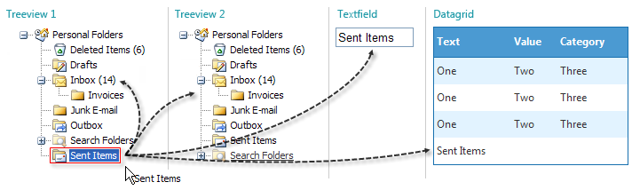

# Drag And Drop

## 

Nodes can be dragged:

* Within the TreeView.

* Between TreeViews.

* From the TreeView to any HTML element.

* From the TreeView to ASP.NET Controls.

>caption 

Depending on the property settings of RadTreeView, multiple items may be dragged at one time.
