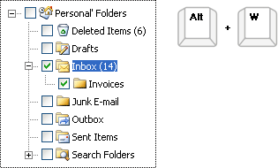
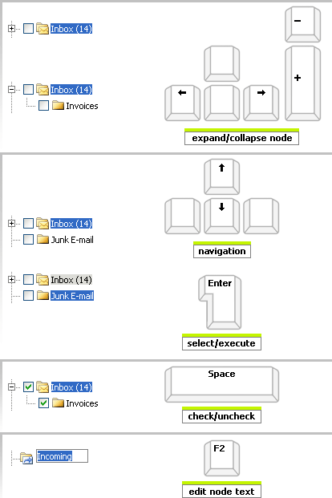

# Keyboard Support


This article demonstrates the usage and the advantages that the __RadTrewView__ provides through its KeyBoard Support.

## 

A critical requirement for software accessibility is keyboard support as a complete alternative to pointing devices (mouse, etc.). RadTreeView provides two aspects of keyboard support:

__1. Access Keys__ - a key combination that allows the end-user to focus on the respective __RadTreeView__ (e.g. Alt+W) and subsequently use the arrow keys for navigation. The access key is defined using the __AccessKey__ property (you need to set __TabIndex__ as well if you want to use __AccessKey__).


The __TabIndex__ attribute (__RadTreeView__ class) specifies the tab stop index of the __RadTreeView__, e.g. when set to 3 the user will have to press Tab three times to focus on the treeview.

>note To focus the RadTreeView in FireFox use the __Shift + Alt + AccessKey__ (or Alt + AccessKey for Chrome and Safari).
>


__Example 1__: Setting the __TabIndex__ and __AccessKey__ properties for __RadTrewView__

````ASPNET
	    <telerik:RadTreeView runat="server" TabIndex="1" AccessKey="W" ... /> </para>
````


>caption 



__2. Arrow Key Navigation and Key Commands__ - allows end-users to navigate around the treeview structure using the arrow keys, as well as to use the Plus, Minus, Space, Enter, and F2 keys for additional control:

* The __Left Arrow__will collapse the current node or navigate to the parent node if the current node is already collapsed.

* The __Right Arrow__ will expand the current node or navigate to the first child node if the current node is already expanded.

* The __Plus/Minus__ keys will expand/collapse the current node.

* The __Up/Down__ arrows will move the node selection one node up/down respectively.

* The __Enter__ key will select the node and fire its event.

* Typing a letter key moves focus to the next instance of a visible node whose title begins with that letter.

* The __Space__ key will check/uncheck the current node (in case it has a checkbox).

* __Home__ key moves to the top node in the treeview.

* __End__ key moves to the last visible node in the treeview.

* __Ctrl+Arrow__ to an item with the keyboard focuses the item (but does not select it). Previous selections are maintained, provided that the "Ctrl" key is not released or that some other keyboard function is not performed.

* __Shift+Up Arrow__ extends selection up one node.

* __Shift+Down Arrow__ extends selection down one node.

* __Shift+Home__ extends selection up to the top-most node.

* __Shift+PageDown__ extends selection down to the last node.

* __Ctrl+Space__ with focus on an item toggles the selection of the item.

* The __F2__ key will make the node text editable (in case the __AllowNodeEditing__ property is set to __true__). Click "Enter" to confirm, "Esc to cancel.

* __*(asterisk)__ on keypad expands all nodes.

__Example 2__: Demonstration of some of the key Navigations of the __RadTrewView__.

>note The __RadTreeView__ KeyBoard Support is implemented base on the[ W3 Specification. ](http://www.w3.org/TR/2010/WD-wai-aria-practices-20100916/#TreeView)
>

