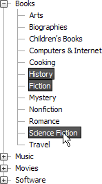

# Multi-Node Selection

## 

Depending on the property settings of the **RadTreeView**, multiple nodes can be selected at one time by holding down the control or shift key and clicking multiple nodes with the mouse. A second click on a selected node will unselect that node.

